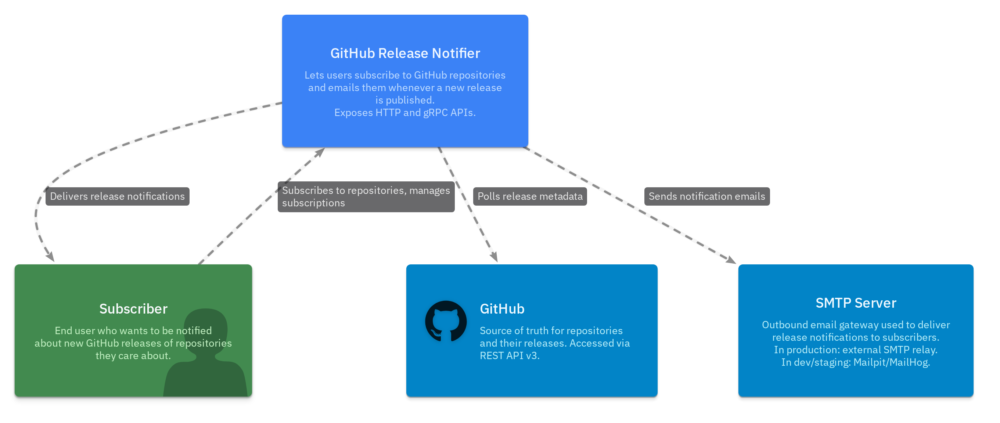
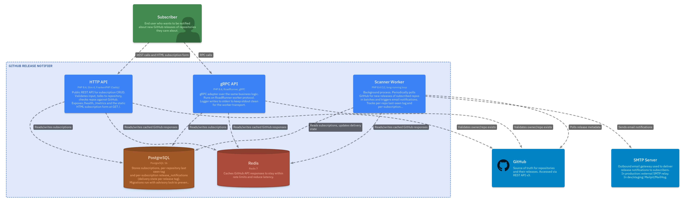
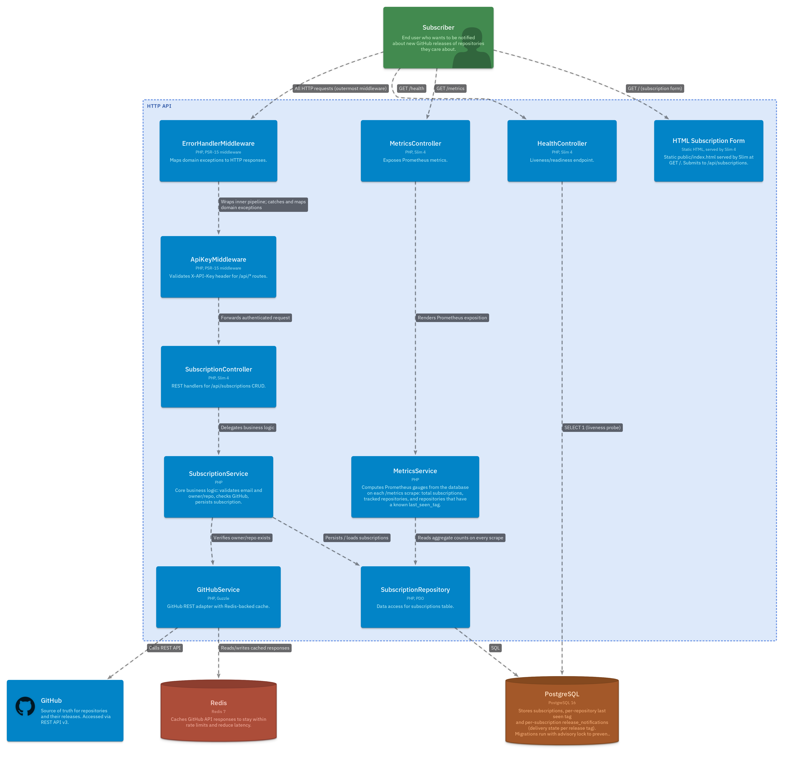
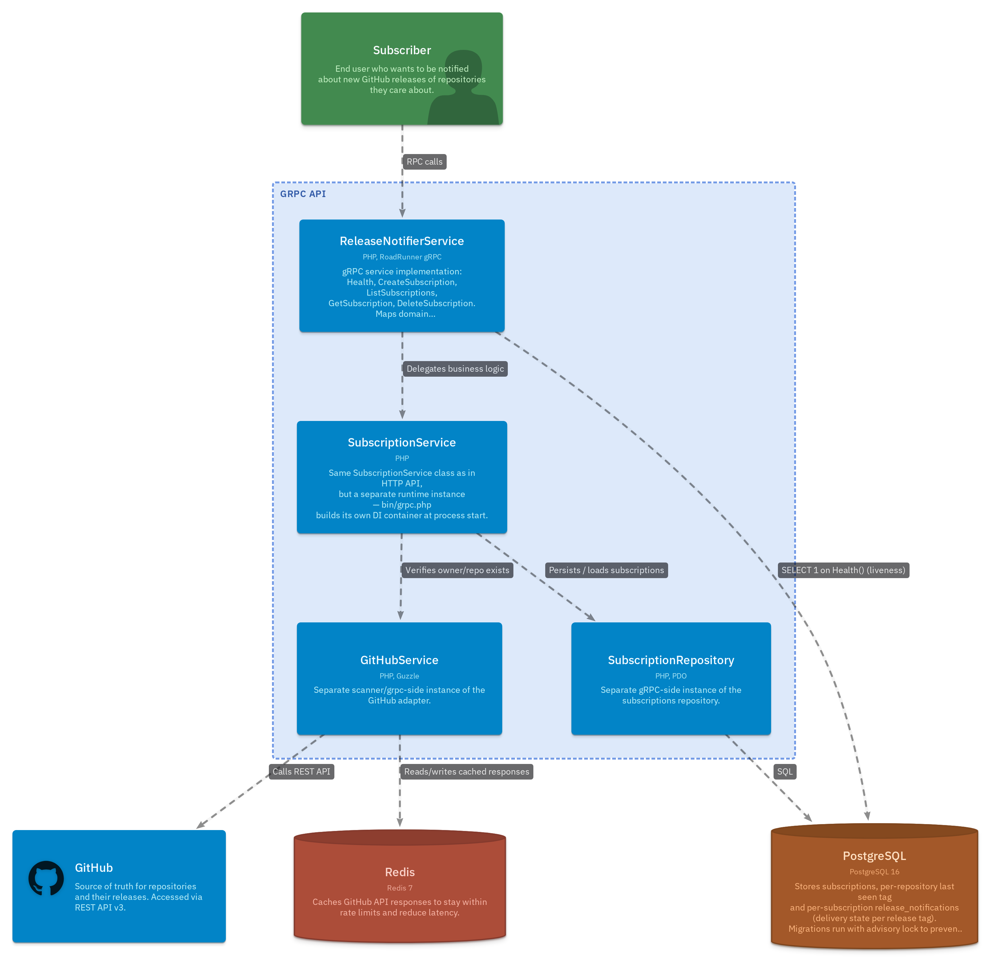
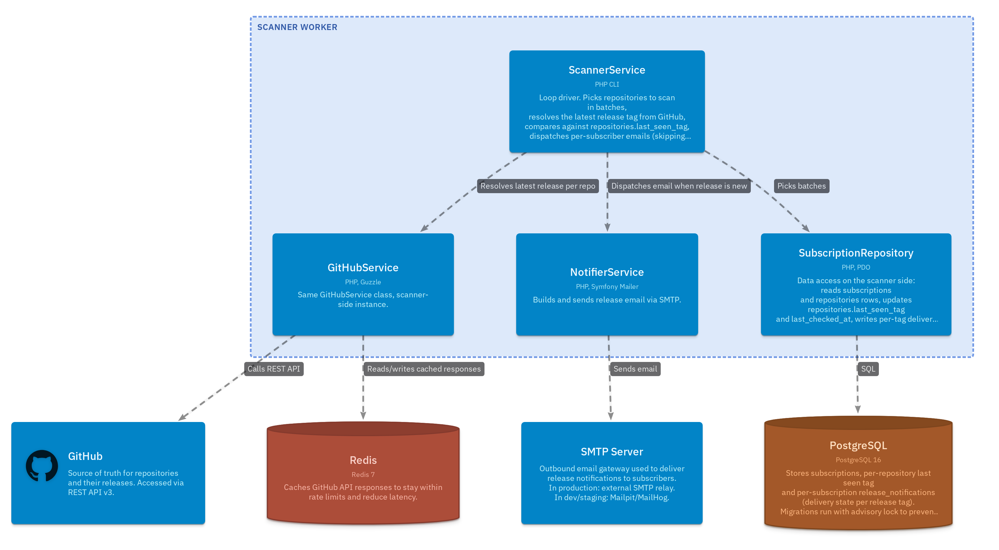
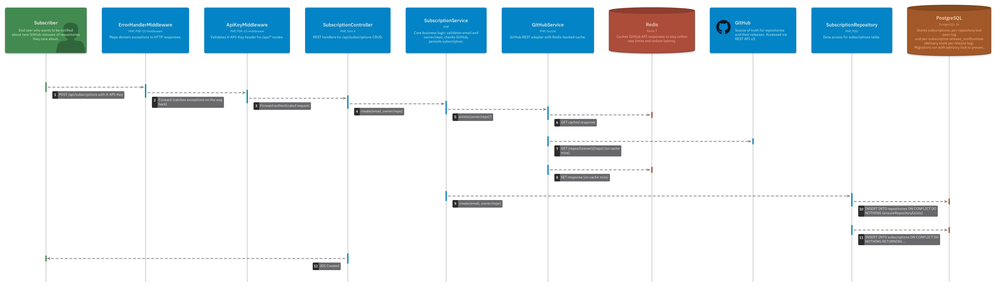
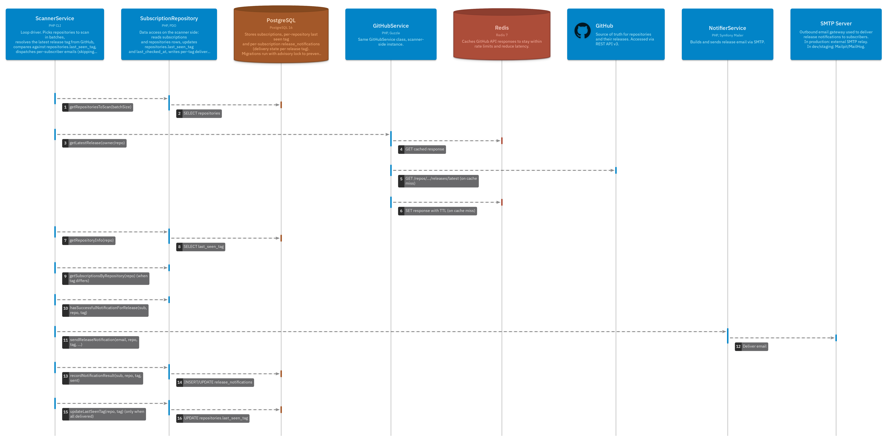

# Architecture (LikeC4)

The C4 model of this project is described in text `.c4` files and rendered via [LikeC4](https://likec4.dev).

## Structure

| File | What it describes |
|------|-------------------|
| `specification.c4` | Element kinds (actor, system, container, component, database, cache) and their styles |
| `landscape.c4` | System Context — user, GitHub, SMTP, the system itself |
| `containers.c4` | Container view — HTTP API, gRPC API, Scanner, PostgreSQL, Redis |
| `components.c4` | Component view — controllers, middleware, services, repositories inside containers |
| `views.c4` | Views: landscape, container, components (HTTP API, gRPC API, Scanner), dynamic flows |

For how to run the LikeC4 preview and export images, see the local
[`README.md`](./README.md).

## Diagrams

The PNG renders below are committed so that the model can be reviewed on GitHub
without running anything locally. To regenerate after changing the model, see
[`README.md`](./README.md).

### 1. System Landscape

The outermost view. A subscriber interacts with the GitHub Release Notifier
over HTTP/gRPC; the system in turn polls GitHub for releases and delivers
notification emails through an SMTP gateway (Mailpit in dev, an external relay
in production).

### 2. Container View

Inside the system there are three deployable PHP processes — the **HTTP API**
(Slim 4 on FrankenPHP), the **gRPC API** (RoadRunner worker), and the
**Scanner Worker** (long-running CLI loop) — plus **PostgreSQL** for
subscriptions and per-repository delivery state, and **Redis** as a cache
layer in front of the GitHub API.

### 3. HTTP API — Components

The request pipeline: every request enters through `ErrorHandlerMiddleware`
(outermost — catches and maps domain exceptions), then `ApiKeyMiddleware`
(validates `X-API-Key` for `/api/*` routes), and is dispatched to one of
the controllers. `SubscriptionController` delegates to `SubscriptionService`,
which coordinates `GitHubService` (cached via Redis) and `SubscriptionRepository`.
`MetricsService` reads aggregate counts directly from the repository on each
`/metrics` scrape. `HealthController` runs a `SELECT 1` against PostgreSQL
for liveness.

### 4. gRPC API — Components

`bin/grpc.php` builds its own DI container at process start, so the gRPC
process holds **separate runtime instances** of `SubscriptionService`,
`SubscriptionRepository`, and `GitHubService` from the HTTP API — they share
the same PHP class but not the same in-memory object. The `Health` RPC also
runs `SELECT 1` directly on PostgreSQL.

### 5. Scanner Worker — Components

`ScannerService` drives the polling loop: it picks repositories in batches,
asks `GitHubService` (Redis-cached) for the latest release, and dispatches
emails via `NotifierService` (Symfony Mailer → SMTP). Per-tag delivery state
is tracked in the `release_notifications` table so a retry never produces
duplicate emails.

### 6. Dynamic — Create Subscription

Sequence layout. A `POST /api/subscriptions` request travels through the
middleware stack, the controller delegates to the service, the service
checks the repository exists on GitHub (using Redis cache where possible),
the repository upserts a `repositories` row first (`ensureRepositoryExists`)
and then inserts the `subscriptions` row, and the controller responds
`201 Created`.

### 7. Dynamic — Scan & Notify

Sequence layout. The scanner picks a batch of repositories, fetches each
repository's latest release through the cached `GitHubService`, compares
the tag with `repositories.last_seen_tag`, and only when the tag is new
proceeds to notify subscribers. Each per-subscriber send is checked against
`release_notifications` to skip already-delivered tags, the email is sent,
and the result is recorded. `last_seen_tag` is advanced only after **all**
subscribers got the email — partial failure leaves it untouched so the next
cycle retries.

