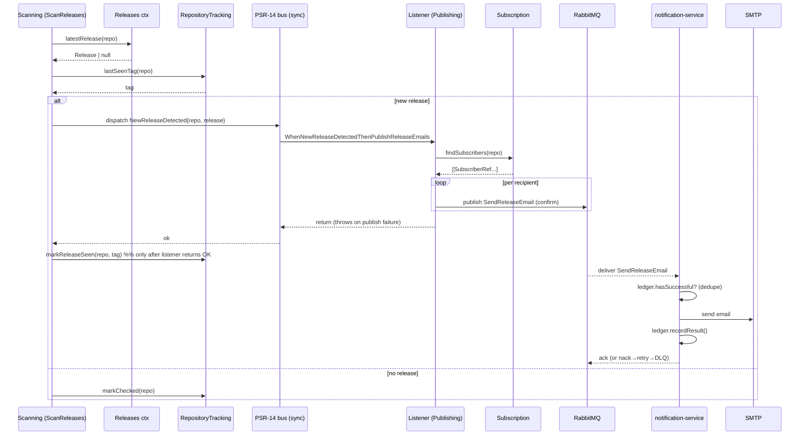

# Architecture — Modular Clean-Architecture Monolith + Notification Microservice

## 1. Principles

1. **Clean / Hexagonal layering inside every module**: `Domain → Application →
   Infrastructure`. The **dependency rule** points inward only:
   - **Domain** — entities, value objects, domain events, domain services,
     **ports** (interfaces), domain exceptions. Zero framework / IO deps.
   - **Application** — use cases (command/query handlers) orchestrating the
     domain through ports; defines outbound ports it needs. Depends on Domain only.
   - **Infrastructure** — adapters implementing ports: PDO repos, Redis, Guzzle,
     RabbitMQ, PHPMailer, **and** the delivery/interface adapters (Slim
     controllers, gRPC handlers, CLI). Depends on Application + Domain.
2. **Pragmatic DDD, CodelyTV-aligned** (decided — see §15): follow the
   `CodelyTV/php-ddd-example` conventions adapted to our Slim/PHP-DI/RoadRunner
   stack (no Symfony):
   - **Value objects** to kill primitive-obsession (`RepositoryName`,
     `EmailAddress`, `ReleaseTag`).
   - **Rich aggregates for entities with identity/lifecycle** — `Subscription`,
     `RepositoryStatus` extend a `Shared\Domain\Aggregate\AggregateRoot` and
     **record domain events** (e.g. `SubscriptionCreated`). Snapshots like
     `Release` stay **anemic value objects** (no identity → not an aggregate).
   - **CQRS-lite**: an **in-house** command bus + query bus (a few interfaces in
     `Shared`, in-memory handlers) — NOT Symfony Messenger. Application use-cases
     become `*CommandHandler` / `*QueryHandler`.
   - **No MySQL/Doctrine outbox** (see §14) — our poll-driven flow self-heals.
   > ⚠️ **Convention change:** this reverses `CLAUDE.md`'s "DTOs are anemic / no
   > `from*`" rule **for entities** (snapshots stay anemic). `CLAUDE.md` must be
   > updated as part of P0/P1 so the rule and the code agree.
3. **Modules = bounded contexts.** Cross-module access is **contract-only** (a
   port exposed by the owning module). No reaching into another module's
   concrete repository/DTO/table.
4. **Wire-format protection** (`CLAUDE.md`): REST JSON, gRPC reply, Behat stay
   unchanged. Refactor is internal.
5. **Strangler-style, dependency-ordered** migration (see §12) so every step
   keeps `lint + phpunit + psalm` green.

## 2. Bounded Contexts (modules)

| Context | Responsibility | Owns (data) | Key ports |
|---|---|---|---|
| **Subscription** | manage `(email, repository)` subscriptions; public REST/gRPC | `subscriptions` | `SubscriptionRepository`, `SubscriberFinder` |
| **RepositoryTracking** | scan registry + progress (`last_seen_tag`) | `repositories` | `ScanCandidateSource`, `ScanProgressWriter`, `RepositoryStatusReader`, `TrackedRepositoryRegistrar` |
| **GitHub** (release sourcing) | fetch/caches releases from GitHub | Redis (cache only) | `ReleaseSource` (`repositoryExists`, `getLatestRelease`) |
| **Scanning** | orchestration / process-manager | — | (driver: CLI loop) |
| **Notification** (monolith side) | publish notification intents | — | `ReleaseNotificationPublisher` |
| **Shared / Platform** | shared kernel + cross-cutting | — | value objects, messaging, error map, health |
| **notification-service** (separate app) | render + send email, idempotency ledger | **own Postgres** (`release_notifications`) | `NotificationLedger`, `Mailer` |

## 3. Dependency Rule (per module)

```
            ┌─────────────────────────────────────────┐
 driving    │  Infrastructure (adapters)               │  driven
 adapters → │   Slim ctrl · gRPC · CLI                 │ → PDO · Redis · Guzzle
            │        │                  ▲              │   RabbitMQ · PHPMailer
            │        ▼                  │ implements   │
            │   Application (use cases) │  ports       │
            │        │                  │              │
            │        ▼                  │              │
            │     Domain (entities, VOs, ports, events)│
            └─────────────────────────────────────────┘
   arrows point INWARD only; Domain depends on nothing.
```

## 4. Target Directory Layout (CodelyTV-aligned, monorepo)

Bounded-context code lives in `src/<Context>/<Module>/<Layer>`; deployables live
in `apps/`. The extracted notification service is a **separate deployable + its
own DB** that shares the repo but talks to the monolith ONLY via RabbitMQ (no
shared tables) — i.e. a real microservice hosted in a monorepo.

```
src/
  Shared/
    Domain/         ValueObject/ (RepositoryName, EmailAddress, ReleaseTag),
                    Aggregate/AggregateRoot, Bus/{Command,Query,Event} (contracts),
                    DomainEvent
    Application/
    Infrastructure/ Bus/ (InMemoryCommandBus, InMemoryQueryBus — in-house, no Symfony),
                    Messaging/Rabbit/, Persistence/Pdo/, Http/ middleware,
                    Error/ExceptionStatusMap, Health/, Metrics/
  Subscription/
    Subscriptions/
      Domain/         Subscription (AggregateRoot → records SubscriptionCreated),
                      SubscriberRef, SubscriberCollection, ports:
                      SubscriptionRepository, SubscriberFinder, exceptions
      Application/    Subscribe/ (SubscribeCommand + SubscribeCommandHandler),
                      Find/ (query + handler), List/ ...
      Infrastructure/ Persistence/PdoSubscriptionRepository, Http/Controller,
                      Grpc/ handler bits, Validation/ adapters, Factory/ ACL mappers
  RepositoryTracking/
    Repositories/
      Domain/         RepositoryStatus (AggregateRoot), 4 role ports
      Application/    Register/, GetDueForScan/, MarkChecked/, MarkReleaseSeen/
      Infrastructure/ Persistence/PdoTrackedRepository{Reader,Writer}, Factory/
  Releases/                          (GitHub release-sourcing context)
    Sourcing/
      Domain/         Release (VO snapshot), ReleaseSource (port), RateLimitException
      Application/    FetchLatestRelease/, RepositoryExists/ (queries)
      Infrastructure/ GitHubApiClient (Guzzle), Cache/ (Redis, Safe/Null decorators)
  Scanning/
    Scanner/
      Application/    ScanReleases/ (ScanReleasesCommand + handler; was ScannerService)
      Infrastructure/ Cli/ scanner loop
  Notification/
    Publishing/                      (monolith publisher side)
      Domain/         ReleaseNotificationPublisher (port),
                      SendReleaseEmail (integration message)
      Application/    PublishReleaseNotifications/ (handler)
      Infrastructure/ Rabbit/RabbitReleaseNotificationPublisher
    Sending/                         (the EXTRACTED service's context)
      Domain/         EmailNotification, NotificationResult, ports:
                      NotificationLedger, Mailer, VOs
      Application/    SendReleaseEmail/ (handler: idempotency → render → send → record)
      Infrastructure/ Rabbit/SendReleaseEmailConsumer, Persistence/PdoNotificationLedger,
                      Mail/(PhpMailerMailer, ReleaseEmailRenderer, RenderedEmail),
                      Http/ health + metrics
apps/
  monolith/
    http/         (Slim — public entry)        grpc/   (RoadRunner)
    scanner/      (CLI loop)                    container.php  (wires all monolith contexts)
  notification/
    consumer/     (worker — wires Notification\Sending ONLY)
    http/         (health/metrics)             container.php
    migrations/   001_create_release_notifications.sql (no FK)
```

`generated/` (gRPC stubs) keeps its role. Controllers/gRPC/CLI are thin drivers
that build a Command/Query and hand it to the bus. **deptrac forbids:** any
Domain→Infrastructure edge, cross-context Infrastructure deps, and
`apps/notification` depending on monolith-only contexts.

## 5. DDD building blocks

- **Value objects** (Shared kernel): `RepositoryName` (validates `owner/repo`,
  replaces the bare string between contexts), `EmailAddress` (absorbs
  `EmailValidator`), `ReleaseTag`.
- **Aggregate roots** (extend `Shared\Domain\Aggregate\AggregateRoot`, record
  domain events): `Subscription` (emits `SubscriptionCreated`), `RepositoryStatus`
  (emits `ReleaseSeenAdvanced`/`RepositoryChecked`). Events are pulled via
  `pullDomainEvents()` and dispatched on the in-house event bus.
- **Anemic value object (snapshot):** `Release` — no identity/lifecycle, stays
  readonly; NOT an aggregate.
- **CQRS-lite buses:** `CommandBus`/`QueryBus` interfaces in `Shared\Domain\Bus`;
  in-memory handler-locator adapters in `Shared\Infrastructure\Bus`. Use-cases are
  `*CommandHandler` / `*QueryHandler`. No Symfony Messenger.
- **Two event planes:**
  - *In-process domain events* — **PSR-14** (`EventDispatcherInterface` +
    `ListenerProviderInterface`), **synchronous, in-memory**. Examples:
    `NewReleaseDetected` (process-level) and aggregate events
    (`SubscriptionCreated`, …). Never leave the process; drive in-process
    reactions + metrics + logging. (No PSR-14 plane exists on this branch yet —
    introduced in HW7; `psr/event-dispatcher` is added as a direct dep.)
  - *Cross-service integration messages* — **RabbitMQ, async**. `SendReleaseEmail`
    is an **integration command** (the monolith already resolved the recipient),
    NOT a domain event. Versioned wire schema.
- **`NewReleaseDetected` flow (decoupling):** `ScanReleases` raises
  `NewReleaseDetected{repository, release}` on the PSR-14 bus; a listener
  `WhenNewReleaseDetectedThenPublishReleaseEmails` (`Notification\Publishing`)
  resolves recipients (Subscription port) and publishes per-recipient
  `SendReleaseEmail` to RabbitMQ. The event is **owned by `Releases\Sourcing\Domain`**
  (the context that owns the `Release` VO it carries), so both the Scanning raiser and
  the Notification listener depend *inward* on Releases — never Scanning → Notification.
  Scanning then depends ONLY on Releases + RepositoryTracking — no direct edge to
  Subscription/Notification.
- **Why a pre-commit *process* event (not an aggregate-saved event):** the event
  is dispatched **synchronously before** `markReleaseSeen` is persisted, and the
  listener publishes within that sync call. If publish throws → the marker is NOT
  advanced → retry next cycle. Modeling it as a `RepositoryStatus` aggregate event
  under the usual *save-then-dispatch* rule would commit the marker **before**
  publishing → a crash window would lose the notification → that is exactly what
  would force an outbox (§14). Keeping it pre-commit is what keeps us outbox-free.
- **Ports:** every cross-boundary call is an interface owned by the inner layer;
  the existing per-consumer ISP interfaces map 1:1 to Domain ports.

## 6. Notification Microservice (internal architecture)

The extracted service is the `Notification\Sending` context (see §4), deployed via
`apps/notification` with its **own Postgres** and no access to monolith tables.

**Use case `SendReleaseEmail\SendReleaseEmailHandler::handle(SendReleaseEmail $msg)`:**
1. `if ledger.hasSuccessfulNotification(subscriptionId, repository, tag) → ack` (dedupe).
2. render email (`ReleaseEmailRenderer`).
3. `mailer.send(email, rendered)`.
4. `ledger.recordResult(...)` (same upsert semantics as today).
5. success → **ack**; transient failure → **nack** (bounded retry → DLQ).

## 7. Integration Architecture (RabbitMQ)

**Topology**
```
publisher (monolith Scanning)                       consumer (notification-service)
   exchange: notifications (topic, durable)
        │  routing key: release.email
        ▼
   queue: notifications.send-email (durable, lazy)
        │  (x-dead-letter-exchange: notifications.dlx)
        ▼  after N attempts
   exchange: notifications.dlx → queue: notifications.send-email.dlq
```

- **Publisher confirms** enabled; publish is per-recipient.
- **Message `SendReleaseEmail` v1** (JSON, additive-only):
  ```json
  {
    "schema": "SendReleaseEmail/v1",
    "eventId": "uuid",
    "occurredAt": "RFC3339",
    "subscriptionId": 123,
    "email": "user@example.com",
    "repository": "owner/repo",
    "release": { "tagName": "v1.2.3", "name": "...", "htmlUrl": "...", "publishedAt": "RFC3339" }
  }
  ```
- **Idempotency**: `eventId` + service ledger `UNIQUE(subscription_id, repository,
  tag_name)`. At-least-once transport → exactly-once *effect*.
- **Retries/DLQ**: limited redelivery via `x-death` count; poison messages land in
  `.dlq` with `last_error` persisted in the ledger.
- **Anti-corruption**: consumer maps the wire message → its own Domain VOs;
  tolerates unknown fields; rejects malformed messages straight to DLQ.

## 8. Sequence — detect → publish → consume → send



Note the **semantic change** (PRD §9): `markReleaseSeen` now fires on successful
*publish*, not on delivery confirmation.

## 9. Data Architecture

- **Monolith Postgres**: `subscriptions`, `repositories`. Drops
  `release_notifications`.
- **Notification Postgres** (new): `release_notifications` — same columns/indexes,
  **FK to `subscriptions` removed**; `subscription_id` is a plain `INTEGER`
  reference (idempotency key component only).
- **Redis**: stays with GitHub context (monolith) only.
- **Migration**:
  1. service migration creates its table;
  2. (optional one-off) copy existing ledger rows monolith→service;
  3. monolith migration drops `release_notifications` (after cutover).
- **Metrics fix** (PRD FR2): replace `MetricsRepository`'s cross-table `COUNT`
  with per-context count ports (`Subscription.count()`, `RepositoryTracking.count()`)
  aggregated by `MetricsService`.

## 10. Cross-Cutting

- **Error mapping**: `ExceptionStatusMap` stays the single HTTP+gRPC map in
  `Shared/Infrastructure/Error`. The notification-service carries its own small
  map for its own exceptions.
- **`RateLimitException`** stays a GitHub-context domain exception, caught at the
  Scanning use-case (unchanged behavior).
- **Health/Metrics**: each deployable exposes its own `/health` + `/metrics`.
- **Config/DI**: `config/container.php` stays the single monolith wiring file,
  now grouped by module; binds **interfaces (ports) → adapters** only, aliasing
  shared instances (per `CLAUDE.md`).
- **Logging**: Monolog/PSR-3 both sides; correlate via `eventId`.

## 11. Deployment / Topology (docker compose)

```
app                (REST, FrankenPHP)            ─┐
grpc               (RoadRunner)                   ├─ monolith image, monolith Postgres + Redis
scanner            (CLI loop, publishes events)  ─┘
rabbitmq           (broker + management UI)
notification-svc   (consumer worker)             ── notification image, notification Postgres
notification-db    (Postgres)
mailhog            (SMTP sink for local/dev — ALREADY EXISTS, reused)
```

- New compose services: `rabbitmq`, `notification-svc`, `notification-db`.
  `mailhog` already exists in `docker-compose.yml` (ports 1025/8025) — reused, not
  re-added. Makefile targets for up/migrate/logs per service.

## 12. Migration Strategy (dependency-ordered, contract-preserving)

Aligned with the `php-refactor-workflow` audit-first / dependency-ordered pattern.

- **P0 — Shared kernel (non-breaking):** add `RepositoryName`, `EmailAddress`,
  `ReleaseTag` VOs; introduce them behind existing signatures incrementally.
- **P1 — Clean-layer the monolith (mechanical):** move classes into
  `Domain/Application/Infrastructure` per module; controllers/gRPC/CLI become thin
  drivers into new use-cases (`SubscribeUseCase`, `ScanReleasesUseCase`, …).
  Behavior unchanged; gates stay green.
- **P2 — Introduce the publisher port (Strangler):** add
  `ReleaseNotificationPublisher` with an **in-process adapter** that calls the
  current dispatcher. Scanning depends on the port. No behavior change yet.
- **P3 — Stand up infra:** add RabbitMQ + MailHog + notification-db to compose;
  add Rabbit publisher adapter (still dual-running optional).
- **P4 — Build notification-service:** new app with Clean layering; move
  Notifier/Renderer/Mailer/Ledger; its own DB + migration (no FK); consumer.
- **P5 — Cutover:** Scanning switches to the Rabbit publisher; service consumes &
  sends; verify end-to-end (MailHog) + idempotency.
- **P6 — Decommission in monolith:** delete in-process dispatcher/ledger/SMTP +
  drop `release_notifications`; update docker compose, README, ADR, LikeC4 model.

## 13. Current → Target mapping (notification cut + key pieces)

| Current (monolith) | Target |
|---|---|
| `Service/ScannerService` | `Scanning/Scanner/Application/ScanReleases/*Handler` |
| `Service/NotificationDispatcher` | `Notification/Publishing/Application/PublishReleaseNotifications/*Handler` + Rabbit publisher |
| `Service/NotifierService` | `Notification/Sending/Application/SendReleaseEmail/*Handler` (service) |
| `Notifier/SmtpMailer`,`ReleaseEmailRenderer`,`RenderedEmail` | `Notification/Sending/Infrastructure/Mail/*` (service) |
| `Repository/NotificationLedger` (+iface) | `Notification/Sending/Infrastructure/Persistence/PdoNotificationLedger` (port in `Sending/Domain`) |
| `migrations/002_*release_notifications` | `apps/notification/migrations/001_*` (no FK); monolith drops table |
| `Service/SubscriptionService` | `Subscription/Subscriptions/Application/{Subscribe,Find,List}/*` |
| `Controller/*`, `Grpc/ReleaseNotifierService` | `*/Infrastructure/{Http,Grpc}/*` thin drivers over the bus |
| `Repository/MetricsRepository` (A+B reach-through) | per-context count ports + `MetricsService` aggregation |
| `Domain/*` anemic DTOs (entities) | aggregate roots in `*/Domain` recording domain events; `Release` stays VO |

## 14. Open Decisions / Tensions

- **DDD depth** — **RESOLVED: Pragmatic DDD, CodelyTV-aligned** (§1, §15): rich
  aggregates for entities + in-house CQRS buses, no Symfony, no outbox.
- **Outbox pattern** — **NOT needed for this flow** (decided). There is no
  dual-write to atomize: the only monolith state write is the `last_seen_tag`
  checkpoint, which happens *after* publish and is a **recomputable high-water
  mark**, not delivery truth. Crash windows self-heal because the next scan cycle
  re-detects the (un-advanced) release and re-publishes, and the consumer is
  idempotent (`eventId` + ledger UNIQUE). Outbox would only suppress rare
  duplicate *publishes* — which the consumer already dedupes — so it is pure
  complexity here. It WOULD be warranted only if we add events that are **not
  re-derivable by polling** (e.g. `SubscriptionCreated`/`SubscriptionDeleted`
  from the HTTP `subscribe()` path) or move to purely event-driven detection.
- **Backfill of existing ledger rows** to the service DB — optional; default is a
  clean start (idempotency is forward-looking).
- **Where the new-vs-seen comparison lives** — stays in Scanning (monolith),
  using RepositoryTracking + GitHub ports (do not move scan state out).

## 15. Reference & Decision Record

- **Reference:** `CodelyTV/php-ddd-example` — Context/Module/Layer under `src/`,
  `apps/` for deployables, Shared kernel, value objects, aggregate roots that
  record domain events, CQRS command/query/event buses, Behat+PHPUnit.
- **Adopted:** structure (Context/Module/Layer + `apps/`), Shared kernel, value
  objects, rich aggregates for entities + domain events, **in-house** CQRS
  command/query bus, repository-port-in-Domain, Object-Mother test fixtures.
- **Adapted (not copied):** Slim/PHP-DI/RoadRunner instead of Symfony; our own
  tiny in-memory command/query bus instead of Symfony Messenger; **PSR-14** for
  the in-process domain-event plane (instead of CodelyTV's EventBus); RabbitMQ
  adapter is our own. Domain events are dispatched **pre-commit, synchronously**
  for the scan→publish path (see §5) — deliberately avoiding the outbox.
- **Rejected:** Symfony framework; MySQL/Doctrine outbox event bus (poll-driven
  flow self-heals — §14). `Release` stays an anemic VO (snapshot, no identity).
- **Follow-on:** update `CLAUDE.md` so the "anemic DTO" rule reads "anemic VO
  snapshots; entities are aggregate roots with domain events" (done in P0/P1).
- **Microservice vs monorepo:** notification is a true microservice (own deploy,
  own DB, RabbitMQ-only integration) but lives in this monorepo under
  `apps/notification` + `src/Notification/Sending`.
