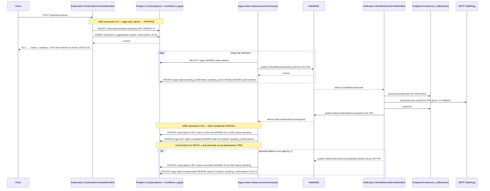
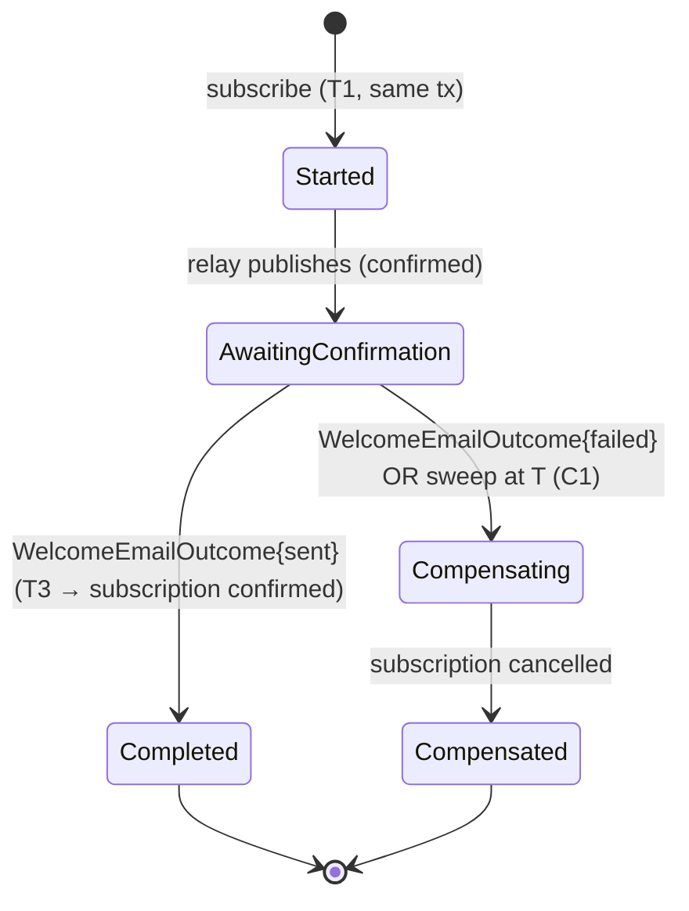

# Architecture — Orchestrated Saga: Confirmed-Subscription Welcome Email

This document resolves every forward-reference the PRD made to "→ architecture.md":
the saga context, the saga state store columns, the subscription `status` column,
the welcome-email ledger, the two integration messages and their topology, the
reply consumer / outbox relay / timeout sweeper worker, the concrete deadline
**T**, and the additive JSON/gRPC `status` field. It traces every FR/NFR/AC of
`prd.md` into a concrete, implementation-ready design grounded in the real code.
2PC is **out of scope** (PRD N1) — it is neither designed nor compared here.

## 1. Principles

The HW7 clean-layering principles (§1 of `specs/hw7-clean-architecture-microservices/architecture.md`)
carry over unchanged; HW9 adds saga-orchestration principles on top.

1. **Clean / Hexagonal layering, dependency rule points inward.**
   `Domain ← Application ← Infrastructure` inside every module. The new `Saga`
   context obeys it exactly: `Saga.Domain` depends on `Shared.Domain` only;
   cross-context reach is always *Application/Infrastructure → another context's
   Domain (ports only)* — never Domain→Domain, never Infra→Infra across contexts
   (the established granted-edge pattern, see section-3).
2. **The persisted saga row is the single source of truth** — never the broker,
   never an in-memory orchestrator. Every transition is a conditional `UPDATE`
   keyed on the current state; the broker only *transports*. This is what makes
   the saga survive a crash, a broker outage, or a redelivery (PRD G3/G4/NFR2).
3. **Atomic saga start, then outbox-style relay.** The subscription row and the
   saga row are written in **one** local DB transaction (no subscription without a
   saga, no saga without a subscription — PRD FR2). The transaction boundary is
   owned by the subscription write path (`SubscribeCommandHandler` via a
   `Shared.Domain` `TransactionManager` port, section-5/section-8), and both PDO
   adapters share the one `PDO::class` instance so they enlist in that single tx.
   The broker publish is **never** the start guarantee: a long-lived relay publishes
   from the persisted `STARTED` row and advances state only on a confirmed publish
   (PRD FR4). **FR4's optional in-request synchronous fast-path publish is
   deliberately *not* implemented** — the relay is the sole publisher; this removes
   a redundant code path and trivially satisfies AC5 (a broker-down at `POST` never
   touches the request thread). A broker outage delays confirmation; it never fails
   the `POST` and never loses the saga (PRD AC5).
4. **State-guarded idempotency.** At-least-once transport → exactly-once *state*
   via `UPDATE … WHERE state = :expected`, treated as a no-op iff `rowCount() = 0`
   (PRD FR9/NFR1). The service-side welcome ledger gives exactly-once *welcome
   send* with the same claim/fencing-token mechanism the release ledger already uses.
5. **Convergence, never hang.** Every saga reaches `COMPLETED` or `COMPENSATED`:
   a terminal `failed` reply compensates immediately; a missing reply is swept at
   deadline **T** (PRD NFR3/FR10). No infinite retry, no permanently-`PENDING`
   subscription.
6. **Wire-format protection, additive only.** JSON gains a `status` field; the
   proto `SubscriptionReply` gains `string status = 5`; the `SendReleaseEmail/v1`
   contract is untouched; Behat/gRPC assertions extend additively (PRD FR13/G5).
7. **Strangler-clean, baseline stays `{}`.** Every new cross-context edge is an
   explicit, justified port edge in `deptrac.yaml`; `deptrac.baseline.yaml` keeps
   `skip_violations: {}` (PRD NFR6/G6). Each migration phase keeps `lint + phpunit
   + psalm` green on both deployables.

## 2. Bounded Contexts (modules)

The HW7 context table gains **one** row — the monolith orchestrator `Saga /
Enrollment`. Existing contexts gain small, listed deltas (a `status` column, a
confirmation-writer port, a welcome path); no context is removed.

| Context | Responsibility | Owns (data) | Key ports (HW9 delta in **bold**) |
|---|---|---|---|
| **Saga / Enrollment** (NEW, monolith) | orchestrate the confirmed-subscription saga: persist saga state, relay `SendWelcomeEmail`, consume `WelcomeEmailOutcome`, sweep timeouts, drive T3/C1 | `enrollment_sagas` (Postgres A) | **`EnrollmentSagaStarter`, `EnrollmentSagaReader`, `EnrollmentSagaWriter`, `WelcomeEmailRelay`** |
| **Subscription** | manage `(email, repository)` subscriptions; public REST/gRPC; **subscription status lifecycle** | `subscriptions` (**+ `status` col**) | `SubscriptionRepository`, `SubscriberFinder` (**now confirmed-only**), **`SubscriptionConfirmationWriter`** |
| RepositoryTracking | scan registry + progress | `repositories` | unchanged |
| Releases (Sourcing) | fetch/cache GitHub releases | Redis (cache) | unchanged |
| Scanning | scan orchestration | — | unchanged |
| Notification\Publishing (monolith) | publish release-email intents | — | `ReleaseNotificationPublisher` (unchanged) |
| **Notification\Sending** (extracted service) | render + send email; idempotency ledger; **welcome path + outcome publisher** | Postgres B: `release_notifications` (**+ `welcome_notifications`**) | `NotificationLedger`, `Mailer`, `EmailRenderer`, **`WelcomeNotificationLedger`, `WelcomeOutcomePublisher`** |
| Shared / Platform | shared kernel + cross-cutting | — | value objects, buses, messaging, error map, **`SagaId` VO, `TransactionManager` port** |

**Why a new context, not an extension of Scanning or Notification\Publishing.**
The saga owns a *new aggregate with identity and lifecycle* (the saga instance),
a *new state store*, and a *new long-lived worker*. Scanning is Domain-less
orchestration over the scan marker; Notification\Publishing is a stateless
fire-and-forget publisher. Neither models persisted process state. `Saga /
Enrollment` is the home for the orchestrator, mirroring how Scanning is the home
for scan orchestration — but with a thin Domain (the saga aggregate) that Scanning
deliberately lacks.

## 3. Dependency Rule & deptrac edges

```
            ┌─────────────────────────────────────────────┐
 driving    │  Saga.Infrastructure (adapters)             │  driven
 adapters → │   bin/saga-worker.php · Pdo*SagaRepository   │ → PDO (Postgres A)
            │   RabbitWelcomeEmailRelay · reply consumer   │   RabbitMQ (publish+consume)
            │        │                  ▲                  │
            │        ▼                  │ implements       │
            │   Saga.Application (orchestrator, handlers)  │
            │        │                  │                  │
            │        ▼                  │                  │
            │   Saga.Domain (EnrollmentSaga, SagaId, ports)│
            └─────────────────────────────────────────────┘
   arrows point INWARD only; Saga.Domain depends on Shared.Domain only.
```

**Three new deptrac layers** added to `deptrac.yaml` after the Scanning block
(mirroring how Scanning is laid out at `deptrac.yaml:81-88`, but Saga **does** have
a Domain layer):

```yaml
- name: Saga.Domain
  collectors: [{ type: directory, value: src/Saga/Enrollment/Domain/.* }]
- name: Saga.Application
  collectors: [{ type: directory, value: src/Saga/Enrollment/Application/.* }]
- name: Saga.Infrastructure
  collectors: [{ type: directory, value: src/Saga/Enrollment/Infrastructure/.* }]
```

**Ruleset edges** (each granted edge carries an inline justification comment,
exactly like the existing `# C2:` / `# B1 grant:` comments at `deptrac.yaml:160,205,230,237`):

```yaml
Saga.Domain:
  - Shared.Domain                  # SagaId VO, Clock, DomainEvent — nothing else
Saga.Application:
  - Saga.Domain
  - Shared.Domain
  - Shared.Application
  - Subscription.Domain            # HW9: orchestrator writes status via SubscriptionConfirmationWriter (confirm/cancel)
Saga.Infrastructure:
  - Saga.Application
  - Saga.Domain
  - Shared.Domain
  - Shared.Application
  - Shared.Infrastructure          # RabbitPublisher, RabbitConnection, RabbitConsumer, PDO::class
```

**Two edges added to existing rulesets** (both are *Application → another context's
Domain*, the canonical pattern):

```yaml
Subscription.Application:
  # …existing…
  - Saga.Domain                    # HW9: SubscribeCommandHandler starts the saga atomically via EnrollmentSagaStarter
```

The `Saga.Application → Subscription.Domain` edge already appears in the Saga block
above (the orchestrator's reply path confirms/cancels the subscription). These two
edges are deliberately **opposite-direction port edges**: Subscription's *write
path* depends inward on `Saga.Domain` (start), and Saga's *reply path* depends
inward on `Subscription.Domain` (confirm/cancel) — neither is a Domain→Domain or
Infra→Infra coupling, so both are legal and minimal. There is no cycle at the layer
deptrac cares about because each edge targets the *Domain* (ports), and the
concrete adapters live in the respective `Infrastructure` layers wired only at the
composition root.

**Load-bearing invariant (the precondition that keeps the two opposite-direction
edges acyclic):** `Saga.Domain` and `Subscription.Domain` must remain **mutually
independent** — each depends on `Shared.Domain` only, **never on each other**. The
correlation key that crosses them is the *primitive* `int $subscriptionId`, never a
foreign value object: `Saga.Domain` never references a Subscription VO, and
`Subscription.Domain` never references `SagaId`. If a future story typed
`subscriptionId` as a Subscription VO inside `Saga.Domain` (or referenced `SagaId`
from `Subscription.Domain`), deptrac would gain a `Saga.Domain ⇄ Subscription.Domain`
cycle and the baseline would be forced to grow. Keeping the crossing key primitive
is therefore a *deptrac* invariant, not merely a data choice (it is why §5 keys the
saga on `int $subscriptionId` and §9/D2 declines any FK).

**Transaction-boundary edge (C1).** The atomic start (section-5/section-8) wraps the
two INSERTs in one tx via a `Shared.Domain` `TransactionManager` port
(`transactional(callable): mixed`) — **not** a raw `PDO` in the Application layer.
`Subscription.Application → Shared.Domain` already exists (`deptrac.yaml:158`), so no
new edge is needed for the boundary; the concrete `PdoTransactionManager`
(`Shared.Infrastructure`) wraps the shared `PDO::class` and is wired at the
composition root. This deliberately avoids granting `Subscription.Application →
Shared.Infrastructure` (which the ruleset does **not** allow).

**`Apps.Monolith` allow-list** (`deptrac.yaml:241-259`) gains the three new layers
so the composition root may wire them:

```yaml
Apps.Monolith:
  # …existing…
  - Saga.Domain
  - Saga.Application
  - Saga.Infrastructure
```

**Notification side** (`apps/notification/deptrac.yaml`): the welcome consumer,
welcome ledger, welcome renderer, and outcome publisher all land under the existing
`Notification.Infrastructure` / `Notification.Domain` / `Notification.Application`
layers, which already permit `Infrastructure → Domain + Application + Shared`. The
`RabbitWelcomeOutcomePublisher` (Infrastructure) implements `WelcomeOutcomePublisher`
(Domain port), and `SendWelcomeEmailConsumer` (Infrastructure) dispatches
`SendWelcomeEmailHandler` (Application) — both within `Infrastructure → {Domain,
Application, Shared}`. The metric additions touch no boundary either:
`NotificationMetric` (the enum) and its recorder interface and
`PdoNotificationMetricsStore` are already in `Sending\Infrastructure\Persistence`,
and `MetricsService` in `Sending\Infrastructure\Metrics` — all inside
`Notification.Infrastructure` (the recorder/reader *interfaces* it depends on live in
`Notification.Application`, an edge that already exists). **No new cross-layer edge
is needed there**, and `deptrac.baseline.yaml` stays `skip_violations: {}` on both
sides (PRD NFR6).

## 4. Target Directory Layout

New monolith context `src/Saga/Enrollment/` + a new worker entrypoint; new
welcome-path files in `apps/notification`. Everything else is unchanged.

```
src/Saga/
  Enrollment/
    Domain/
      EnrollmentSaga.php              # AggregateRoot: state machine + recordThat()
      SagaState.php                   # enum: Started|AwaitingConfirmation|Completed|Compensating|Compensated
      SagaId.php                      # (or promote to Shared/Domain/ValueObject — see §5)
      EnrollmentSagaStarter.php       # port: start(subscriptionId): void  (called in T1 tx)
      EnrollmentSagaReader.php        # port: dueForRelay(limit), dueForSweep(now, T), byId
      EnrollmentSagaWriter.php        # port: markPublished(id), advance transitions (conditional)
      WelcomeEmailRelay.php           # port: publish(SendWelcomeEmail): void (confirmed)
      SagaNotFoundException.php
      events/  SagaStarted, WelcomePublished, SagaCompleted, SagaCompensated
    Application/
      Start/        StartEnrollmentSagaService.php   # the in-tx starter impl façade (Domain port)
      Relay/        RelayPendingWelcomeEmails.php     # outbox relay use-case
      HandleOutcome/ HandleWelcomeEmailOutcomeCommand.php + Handler  # CQRS command (reply path)
      Sweep/        SweepTimedOutSagas.php            # timeout sweeper use-case
    Infrastructure/
      Persistence/  PdoEnrollmentSagaRepository.php   # implements Starter+Reader+Writer (ISP-alias)
      Rabbit/       RabbitWelcomeEmailRelay.php        # publishes SendWelcomeEmail w/ confirms
                    WelcomeEmailOutcomeConsumer.php    # consumes reply → dispatches command
                    WelcomeEmailOutcomeMessageMapper.php (EXPECTED_SCHEMA = WelcomeEmailOutcome/v1)
                    SendWelcomeEmailSerializer.php
      Worker/       SagaWorker.php                     # supervised loop: relay + consume + sweep

src/Subscription/Subscriptions/
  Domain/         SubscriptionConfirmationWriter.php   # port: confirm(id), cancel(id) — conditional
  Infrastructure/Persistence/ PdoSubscriptionConfirmationWriter.php  # NEW adapter (or fold into repo)

src/Shared/Domain/ValueObject/SagaId.php               # promoted UUID VO (decision §5)
src/Shared/Domain/TransactionManager.php               # NEW port: transactional(callable): mixed (atomic start, §5/§8)
src/Shared/Infrastructure/Persistence/PdoTransactionManager.php  # NEW adapter over the shared PDO::class

bin/
  saga-worker.php                     # NEW long-lived entrypoint → SagaWorker::run()

migrations/
  004_add_subscription_status.sql     # subscriptions.status PENDING default
  005_create_enrollment_sagas.sql     # saga state store
  006_create_saga_metrics.sql         # generic monolith counter table (event counts, §10/AC7)

apps/notification/
  src/Sending/
    Domain/        WelcomeEmail.php, WelcomeNotificationKey.php,
                   WelcomeNotificationLedger.php (port), WelcomeOutcomePublisher.php (port)
    Application/   SendWelcomeEmailHandler.php          # claim → render → send → markSent → publish outcome
    Infrastructure/
      Rabbit/      SendWelcomeEmailConsumer.php, SendWelcomeEmailMessageMapper.php
                   (EXPECTED_SCHEMA = SendWelcomeEmail/v1),
                   RabbitWelcomeOutcomePublisher.php    # NEW — first publisher in the service
      Mail/        WelcomeEmailRenderer.php             # NEW template
      Persistence/ PdoWelcomeNotificationLedger.php
  migrations/      007_create_welcome_notifications.sql
contracts/
  send-welcome-email.v1.json          # golden
  welcome-email-outcome.v1.json       # golden
```

`bin/saga-worker.php` and the Saga context are wired in the single
`config/container.php` (section-10). The notification welcome path is wired in
`apps/notification/config/container.php`.

## 5. DDD building blocks (the saga aggregate + ports + orchestrator)

- **`SagaId` value object.** A UUIDv4 VO, `final readonly class SagaId implements
  \Stringable`, self-validating in the ctor (throws
  `App\Shared\Domain\Exception\InvalidArgumentException` on a malformed UUID),
  `value()` / `__toString()` / `equals()`, plus `fromString()` and `generate()`.
  **Decision: promote it to `src/Shared/Domain/ValueObject/SagaId.php`** rather than
  reuse `Notification\Publishing`'s `EventIdGenerator`, so `Saga.Domain` needs no
  cross-context edge to mint ids (keeps the edge set minimal). The Subscription
  write path and the Saga worker both reference `Shared.Domain` already.

- **`EnrollmentSaga` aggregate** extends `App\Shared\Domain\Aggregate\AggregateRoot`
  (mutable child, like the base allows — unlike `Subscription` it advances state).
  Identity: `SagaId`. Correlation key: `subscriptionId` (1:1 with the subscription,
  PRD FR2/D2). It holds `SagaState`, `awaitingSince`, and records domain events
  (`SagaStarted`, `WelcomePublished`, `SagaCompleted`, `SagaCompensated`). Each
  use-case (start, relay, reply orchestrator, sweeper) loads/builds the aggregate,
  applies the transition method, and — only when the persistence write actually
  advanced the row — drains `pullDomainEvents()` onto the PSR-14 plane, where the
  `LogSagaTransition` listener turns each into one correlated funnel log line (§10).
  State-count metrics stay `rowCount`-derived (a no-op is not a domain event), so the
  event plane is observability, not a second source of truth. The aggregate is the
  domain-logic guard and event source; the **PDO adapter is the concurrency guard**,
  enforcing transitions atomically with conditional `UPDATE … WHERE state = :expected`.

- **`SagaState` enum** (string-backed): `Started`, `AwaitingConfirmation`,
  `Completed`, `Compensating`, `Compensated`. Mirrors the PRD §1.1 saga lifecycle
  exactly. `Started` = "not yet published"; `AwaitingConfirmation` = "published +
  publish-confirmed, awaiting reply" — this **is** the outbox publish-state marker
  (PRD FR4); no separate `command_published_at` boolean is needed because the state
  itself distinguishes the two.

- **Ports (Saga.Domain), per-consumer ISP** (the `*Reader`/`*Writer`/`*Starter`
  split, like `SubscriptionRepository` implements three narrow interfaces):
  - `EnrollmentSagaStarter::start(int $subscriptionId): void` — the only method the
    Subscription write path sees; runs **inside T1's transaction** (section-8).
  - `EnrollmentSagaReader::dueForRelay(int $limit): iterable` (state=`Started`),
    `dueForSweep(\DateTimeImmutable $now, int $timeoutSeconds): iterable`
    (state=`AwaitingConfirmation` AND `awaiting_since < now - T`),
    `dueForStartSweep(\DateTimeImmutable $now, int $startTimeoutSeconds): iterable`
    (state=`Started` AND `created_at < now - T_start` — the broker-down backstop so a
    never-published `Started` saga still converges, §8/§9/NFR3),
    `findBySubscriptionId(int)`.
  - `EnrollmentSagaWriter` — the conditional transitions: `markPublished(SagaId)`
    (`Started → AwaitingConfirmation`, sets `awaiting_since = NOW()`),
    `complete(SagaId)` (`Started|AwaitingConfirmation → Completed`),
    `compensate(SagaId)` (`Started|AwaitingConfirmation → Compensating → Compensated`),
    `recordRelayFailure(SagaId, string $error)` (increments `attempts`, sets
    `last_error`, no state change — relay-publish observability, §9). Each transition
    returns `bool` (= `rowCount() > 0`) so the orchestrator can treat a redelivery as
    a no-op (PRD FR9). **`complete()` deliberately accepts both `Started` and
    `AwaitingConfirmation`** as legal pre-states: a `WelcomeEmailOutcome{sent}` can
    legitimately arrive before the relay's `markPublished` UPDATE has committed (the
    notification side claims/sends as soon as it consumes), so the saga state is
    *advisory for relay/sweep scheduling*; the true single-writer lock is the
    subscription `status = 'pending'` guard (below). Restricting `complete()` to
    `AwaitingConfirmation` only would strand a successfully-sent saga in `Started`
    until the sweeper wrongly compensated it (the reply-before-relay hole, §7).
  - `WelcomeEmailRelay::publish(SendWelcomeEmail): void` — implemented by
    `RabbitWelcomeEmailRelay` with publisher confirms; throws on an unconfirmed
    publish so the saga is **not** advanced (the relay re-tries next tick, after
    `recordRelayFailure`).

- **`SubscriptionConfirmationWriter` (Subscription.Domain), NEW port** —
  `confirm(int $id): bool` / `cancel(int $id): bool`, each a conditional `UPDATE
  subscriptions SET status = :new WHERE id = :id AND status = 'pending'` returning
  `rowCount() > 0`. Implemented by a Subscription.Infrastructure PDO adapter. This
  is the edge `Saga.Application → Subscription.Domain`.

- **The orchestrator** is the reply-path command handler
  `HandleWelcomeEmailOutcomeHandler` (`CommandHandler<HandleWelcomeEmailOutcomeCommand>`).
  It wraps **one** Postgres-A transaction (via the `Shared.Domain` `TransactionManager`
  port) and, in it, applies the saga transition **and** the subscription status
  transition as a paired conditional `UPDATE` (section-8). It depends on
  `EnrollmentSagaWriter` (Saga.Domain), `SubscriptionConfirmationWriter`
  (Subscription.Domain) and `TransactionManager` (Shared.Domain) — all Domain ports.
  **When both conditional UPDATEs return `rowCount() = 0` the handler returns
  success** (the transition was already applied, or is terminally moot — e.g. a
  `sent` reply that arrives after the sweeper already compensated): the reply consumer
  then **acks and drops** the message. This is what stops the no-DLX reply queue (§7)
  from redelivering a no-op reply forever. A no-op reply increments
  `welcome_reply_noop_total` so a `sent`-after-cancel (the bounded one-extra-email
  case, §14) is *observable* rather than silently swallowed.

- **`TransactionManager` (Shared.Domain), NEW port** — `transactional(callable $work):
  mixed`, runs `$work` inside `beginTransaction()` / `commit()` with `rollBack()` on
  any throw. Implemented by `PdoTransactionManager` (`Shared.Infrastructure`) over the
  single shared `PDO::class`. It is the one transaction-boundary abstraction both the
  atomic start (Subscription side, below) and the reply orchestrator (Saga side, above)
  use — neither layer touches a raw `PDO`, so no `*.Application → Shared.Infrastructure`
  edge is needed (only the existing `*.Application → Shared.Domain`).

- **Atomic saga start in `SubscribeCommandHandler` (C1 resolution, PRD FR2/FR3).**
  Today the handler calls `repository->create($subscription)` and dispatches the
  PSR-14 event — `create()` runs a bare `INSERT … ON CONFLICT (email, repository) DO
  NOTHING RETURNING id` with **no** explicit transaction, and the handler holds no
  `PDO`. HW9 wraps the create + saga-start in **one** `TransactionManager::transactional`
  closure: (1) `id = $repository->create($subscription)->id()` — the existing
  RETURNING-id path on insert, or the SELECT-fallback id on a duplicate `POST`;
  (2) `$sagaStarter->start($id)` — `INSERT enrollment_sagas(...) ON CONFLICT
  (subscription_id) DO NOTHING`. Because `PdoSubscriptionRepository` and
  `PdoEnrollmentSagaRepository` are both wired on the **same** `PDO::class` DI binding,
  they enlist in the one transaction the `TransactionManager` opened; a crash between
  the two INSERTs commits neither (FR2/FR3), and a duplicate `POST` collapses both the
  subscription (existing `ON CONFLICT (email, repository) DO NOTHING` + SELECT-fallback)
  **and** the saga (`ON CONFLICT (subscription_id) DO NOTHING`) to a no-op (§8, §9,
  L1). The handler gains an `EnrollmentSagaStarter` (Saga.Domain) and a
  `TransactionManager` (Shared.Domain) constructor dependency — both Domain ports.

- **CQRS dispatch.** The reply consumer builds a `HandleWelcomeEmailOutcomeCommand`
  and dispatches it through the existing `InMemoryCommandBus` (a new row in the
  `config/container.php:304` map). The relay and sweeper are use-cases invoked
  directly by the worker loop (no command needed — they are not transport-triggered).

## 6. Notification service welcome-email path (internal)

The extracted service gains a **second** consumer, a welcome ledger, a welcome
template, and its **first ever publisher** (PRD §3.2 — today it only ack/nacks).

**Use case `SendWelcomeEmailHandler::handle(WelcomeEmail $msg): void`** — modeled
on `SendReleaseEmailHandler` (the claim/render/send/markSent flow), keyed for welcome:

1. `key = WelcomeNotificationKey(subscriptionId)` — **keyed by `subscriptionId`
   only** (one welcome per subscription, PRD FR6), *not* by `(subscriptionId,
   repository, tag)` like the release ledger.
2. `claim = welcomeLedger.claim(key, email)` — atomic claim/fence (same
   `INSERT … ON CONFLICT … DO UPDATE … WHERE sent_at IS NULL AND terminal_failed_at
   IS NULL AND (claimed_at IS NULL OR claimed_at < NOW() - INTERVAL '300 seconds')
   RETURNING id` shape as `PdoNotificationLedger`, **plus** the `terminal_failed_at
   IS NULL` guard so a terminally-failed welcome is never re-claimed). The claim
   resolves to one of four `ClaimOutcome` cases: `Claimed`, `InFlight`, `AlreadySent`,
   `AlreadyFailed`.
3. `ClaimOutcome::AlreadySent` (`sent_at IS NOT NULL`) → `recordWelcomeDeduped()`,
   **publish `outcome: sent`** (so a redelivery after a prior success still produces a
   reply, never a silent drop), return.
4. `ClaimOutcome::AlreadyFailed` (`terminal_failed_at IS NOT NULL`) →
   **publish `outcome: failed`** (re-emit the terminal reply, **no re-send**), then
   `nack(requeue:false)` to the DLQ (completing the disposition the prior attempt
   could not confirm). This is the case that makes a redelivery after a
   *failed-reply-publish-failure* idempotent (see terminal-failure branch below).
5. `ClaimOutcome::InFlight` → throw the in-flight exception → consumer parks
   `CLAIM_LEASE_SECONDS = 300s` without consuming retry budget (existing pattern).
6. `Claimed`: `welcomeRenderer.render(msg)` → `mailer.send(...)`. On send throw →
   `recordFailedAttempt(...)`, rethrow → consumer retries within `MAX_REDELIVERIES = 3`.
7. `welcomeLedger.markSent(...)` true → `recordWelcomeSent()`, **publish `outcome:
   sent`**; false (fenced) → `recordWelcomeSuperseded()`, return.

**Terminal-failure reply (PRD FR7) — the net-new mechanism.** Because the existing
consumer silently DLQs an exhausted message, the welcome consumer's failure branch
is, when `shouldRouteToDlq($message, MAX_REDELIVERIES)` is true:
1. `welcomeLedger.markTerminalFailed(key, error)` — sets `terminal_failed_at = NOW()`
   on the ledger row (in the same statement that records the terminal attempt);
2. **publish `WelcomeEmailOutcome{failed}`** (with its own fail-closed publisher
   confirm);
3. **then** `nack(requeue:false)` to the DLQ.

Persisting `terminal_failed_at` **before** publishing is what makes the redelivery
loop safe: if the `failed` outcome publish cannot be confirmed, the consumer **does
not nack** and exits for supervised restart (fail-closed); on redelivery the claim
returns `ClaimOutcome::AlreadyFailed` (step 4 above) — it re-publishes `failed` and
**does not re-send the email**. Without the `terminal_failed_at` marker a redelivery
would find `claimed_at`/`sent_at` both NULL (a `recordFailedAttempt` clears the
lease), re-claim, and *re-send* a terminally-failed welcome — breaking the NFR1
"at most one extra email" bound and risking an infinite re-send loop while SMTP and
the reply-publish both keep failing. The `terminal_failed_at` column is added to
migration `007` and the `ClaimOutcome::AlreadyFailed` case to the welcome ledger
(§9). A re-published `failed` after a supervised restart is in turn deduped at the
**monolith orchestrator** by its `WHERE state IN ('started','awaiting_confirmation')`
guard (FR9, §5), so the duplicate reply compensates at most once (§7 reply-dedup).

**Renderer.** A NEW `WelcomeEmailRenderer` implementing the existing
`EmailRenderer` port (subject e.g. `"Welcome — you're subscribed to {repository}"`,
htmlspecialchars-escaped HTML + text), distinct from `ReleaseEmailRenderer`.

**Publisher.** `RabbitWelcomeOutcomePublisher implements WelcomeOutcomePublisher`,
the service's first publisher: it opens a dedicated confirm-mode channel (the same
`confirm_select` + `set_nack_handler` + `wait_for_pending_acks` fail-closed pattern
already used by `RabbitConsumer::republishDelayed`) and publishes
`WelcomeEmailOutcome/v1` to `notifications` on routing key
`subscription.welcome-email.reply`.

**Metrics (PRD AC7).** Extend `NotificationMetric` (the
`Sending\Infrastructure\Persistence` enum) with cases
`WelcomeConsumed='welcome_consumed_total'`, `WelcomeSent='welcome_sent_total'`,
`WelcomeDeduped='welcome_deduped_total'`, `WelcomeFailed='welcome_failed_total'`,
`WelcomeReplyPublished='welcome_reply_published_total'`; add recorder methods to the
`MessageProcessingStatsRecorder` (`Sending\Application`) interface +
`PdoNotificationMetricsStore` (`Sending\Infrastructure\Persistence`), reader methods
on `NotificationMetricsReader` (`Sending\Application`), and rows in
`MetricsService::collect` (`Sending\Infrastructure\Metrics`). These persist in the
existing `notification_metrics(metric_name PK, metric_value BIGINT)` counter table —
no migration for metrics (the table is generic, incremented per event), only enum +
code. All five spellings match PRD AC7 exactly.

## 7. Integration Architecture (RabbitMQ)

**Topology.** Two new queues + a reply binding on the existing topic exchange
`notifications`, mirroring the `notifications.send-email` family (PRD §3.3).
Declared idempotently in `RabbitConnection::assertTopology()` on **both** sides
(monolith `src/Shared/.../RabbitConnection.php` and `apps/notification/src/Shared/.../RabbitConnection.php`).

```
 monolith saga-worker (relay)                  notification welcome consumer
   exchange: notifications (topic, durable)  ── ROUTING_KEY_WELCOME_EMAIL = 'subscription.welcome-email'
        │                                         ▼
        │                              queue: notifications.welcome-email (durable, DLX→notifications.dlx)
        │                                         │  retry: notifications.welcome-email.retry (TTL park)
        │                                         │  dlq:   notifications.welcome-email.dlq
        ▼  publishes SendWelcomeEmail (confirms)  │
   ───────────────────────────────────────────── │ on terminal outcome / success:
   queue: notifications.welcome-email-reply  ◄────┘  publish WelcomeEmailOutcome
   (durable) bound on key 'subscription.welcome-email.reply'   (notification → monolith)
        ▲
        └── monolith saga-worker (reply consumer) consumes here
```

**Topology constants (one source of truth, added to both `RabbitConnection`s):**

| Constant | Value |
|---|---|
| `ROUTING_KEY_WELCOME_EMAIL` | `subscription.welcome-email` |
| `QUEUE_WELCOME_EMAIL` | `notifications.welcome-email` |
| `QUEUE_WELCOME_EMAIL_RETRY` | `notifications.welcome-email.retry` |
| `QUEUE_WELCOME_EMAIL_DLQ` | `notifications.welcome-email.dlq` |
| `ROUTING_KEY_WELCOME_EMAIL_REPLY` | `subscription.welcome-email.reply` |
| `QUEUE_WELCOME_EMAIL_REPLY` | `notifications.welcome-email-reply` |

The welcome work queue reuses the existing `notifications.dlx` fanout for DLQ and
the same TTL-park retry mechanism (`x-dead-letter-routing-key` = the work queue).

**Naming note (the reply queue breaks the dotted-suffix convention deliberately).**
The work-queue family uses dotted suffixes (`notifications.welcome-email`,
`.retry`, `.dlq`) because `.retry`/`.dlq` are *children* of the work queue (DLX
parking). The reply queue is a **sibling**, not a DLQ/retry of the work queue, so it
is `notifications.welcome-email-reply` (hyphen), **not**
`notifications.welcome-email.reply` — which would collide with the work-queue dotted
family and be mistaken for its parking queue. Do not "correct" the hyphen.

**Reply-queue disposition.** The reply queue is a plain durable queue bound on the
reply routing key; it has **no DLX of its own**. Two dispositions, made explicit:
- A **malformed** `WelcomeEmailOutcome` (fails the `EXPECTED_SCHEMA` gate) is
  **logged + acked (dropped)** — with no DLX, a `nack(requeue:false)` would discard
  it anyway, so an explicit ack-drop is clearer and avoids a redelivery loop. The
  saga's timeout sweeper is the backstop (accepted risk: a malformed-but-`sent`
  reply leads to a false-cancel at T — bounded, observable via the malformed-reply
  log line + the `welcome_reply_consumed_total` not incrementing).
- A **well-formed but no-op** reply (both conditional UPDATEs `rowCount() = 0`, §5)
  is **acked and dropped** and increments `welcome_reply_noop_total` — never
  redelivered. The timeout sweeper remains the ultimate backstop for a *missing*
  reply.

**Message `SendWelcomeEmail/v1`** (monolith → notification; golden
`contracts/send-welcome-email.v1.json`; consumer tolerates unknown fields):

```json
{
  "schema": "SendWelcomeEmail/v1",
  "sagaId": "5f1c0e2a-9b3d-4c7a-8e21-7c9b0d4e1f33",
  "subscriptionId": 123,
  "email": "user@example.com",
  "repository": "owner/repo",
  "occurredAt": "2026-06-20T12:00:00+00:00"
}
```

Published with `content_type: application/json`, `delivery_mode: 2` (persistent),
and AMQP `correlation_id = sagaId`. The mapper's `EXPECTED_SCHEMA =
'SendWelcomeEmail/v1'` gate rejects anything else to its DLQ. The reply address is
fixed by topology (the reply routing key is a constant), so no per-message
`reply_to` is required; `correlation_id` carries the `sagaId` for trace continuity.

**Message `WelcomeEmailOutcome/v1`** (notification → monolith; golden
`contracts/welcome-email-outcome.v1.json`):

```json
{
  "schema": "WelcomeEmailOutcome/v1",
  "sagaId": "5f1c0e2a-9b3d-4c7a-8e21-7c9b0d4e1f33",
  "subscriptionId": 123,
  "outcome": "sent",
  "error": null,
  "occurredAt": "2026-06-20T12:00:03+00:00"
}
```

`outcome` ∈ `{ "sent", "failed" }`; `error` is present (a short string) only on
`failed`. The monolith mapper's `EXPECTED_SCHEMA = 'WelcomeEmailOutcome/v1'`.

**Idempotency / at-least-once → exactly-once state (PRD NFR1/FR6/FR9).**
- *Send dedup*: the welcome ledger's `UNIQUE(subscription_id)` claim makes a
  redelivered or re-relayed `SendWelcomeEmail` a no-op (`ClaimOutcome::AlreadySent`)
  — and it still emits a `sent` reply so the saga can complete.
- *Reply dedup*: the **subscription `status = 'pending'` guard is the true
  single-writer lock**; the saga-row UPDATE is advisory. The orchestrator's paired
  conditional `UPDATE subscriptions … WHERE status = 'pending'` + `UPDATE saga …
  WHERE state IN ('started','awaiting_confirmation')` makes a redelivered or
  concurrent `WelcomeEmailOutcome` a no-op (`rowCount() = 0` ⇒ ack-and-drop, §5).
  Replaying `sent` 3× confirms once; replaying `failed` 3× cancels once (PRD AC3).
- *Reply-before-relay*: a `sent` reply can arrive while the saga is still `Started`
  (the relay published and the notification side already sent + replied, but the
  relay's own `markPublished` UPDATE to `AwaitingConfirmation` hasn't committed yet,
  or its publisher-confirm callback is still in flight). Because `complete()` accepts
  `Started|AwaitingConfirmation` (§5), it confirms correctly instead of stranding the
  saga; the subscription guard is pre-state-agnostic, so it is unaffected.
- *Sent-after-cancel*: if the sweeper already drove `compensated`/`cancelled` and a
  late `sent` arrives, both UPDATEs return `rowCount() = 0`; the reply is acked,
  `welcome_reply_noop_total` increments — the email was already (bounded) sent, the
  subscription stays `CANCELLED` consistently (§14 in-flight bound).
- *Correlation*: `sagaId` ties every reply to its saga row; `subscriptionId` is the
  cross-DB business key (no FK crosses the boundary, PRD D4).

**Retries / DLQ.** The welcome work queue uses the identical bounded-retry envelope
as the release queue: `MAX_REDELIVERIES = 3`, backoff `5 / 10 / 20s` via the TTL
retry-park, then DLQ. The contract tests (producer = monolith serializer vs golden;
consumer = notification mapper tolerates unknown fields) follow the existing
`SendReleaseEmailWireContractTest` discipline.

## 8. Sequence + saga state machine

**Happy path + compensation (mermaid sequence):**



**Saga state machine (mermaid state diagram):**



`Started` is also a (rare) compensation source: if a saga is swept while still
`Started` (the broker stayed down so the relay never confirmed a publish past the
**start deadline `T_start`**), `compensate()` accepts `Started` as a valid pre-state
and cancels the subscription — the saga still converges (PRD NFR3). The sweeper
therefore runs **two** queries (§5/§9): the primary one over `AwaitingConfirmation`
sagas past `awaiting_since + T`, and a secondary one over `Started` sagas past
`created_at + T_start` so a broker-down `Started` saga (whose `awaiting_since` is
`NULL`, hence invisible to the primary sweep) cannot hang `PENDING` forever
(NFR3). `T_start ≥ T` (default `T_start = 900s`) so a saga that is merely waiting on
a slow-but-recovering broker is not compensated prematurely.

## 9. Data Architecture

**Migration `004_add_subscription_status.sql` (Postgres A):**

```sql
ALTER TABLE subscriptions
    ADD COLUMN IF NOT EXISTS status VARCHAR(16) NOT NULL DEFAULT 'pending';
CREATE INDEX IF NOT EXISTS idx_subscriptions_repository_status
    ON subscriptions(repository, status);
```

- `status` ∈ `{ pending, confirmed, cancelled }`. `DEFAULT 'pending'` means existing
  rows and any direct INSERT are PENDING; the saga drives the rest. The composite
  `(repository, status)` index serves the confirmed-only recipient query (FR14).
- **Surfacing `status` is a multi-touch projection change (C2).** Every read path that
  reconstitutes a `Subscription` must select the new column, because today they all
  hard-code a 4-column list. Concretely: extend the `SELECT id, email, repository,
  created_at` projections in **`PdoSubscriptionRepository::create` (both the
  RETURNING list and the SELECT-fallback), `findById`, `findByEmailAndRepository`,
  `findByEmail`, `findAll`** to `… , status`; add a `status` parameter to
  `Subscription::reconstitute(...)` and to `SubscriptionFactoryInterface::reconstitute
  (array $row)` (it maps `$row['status']`); add the `status` field to
  `SubscriptionResponse` and to the query-side response factory that builds it. The
  query re-read in `SubscriptionController::create` then sees the **committed**
  `pending` row (never a stale pre-insert state), so AC1's "readable with `status:
  pending` immediately after `201`" holds. `findSubscribersByRepository` is the **one
  exception** — it is the recipient-resolution SELECT and is filtered, not merely
  projected (see below / §13).

**Migration `005_create_enrollment_sagas.sql` (Postgres A) — the saga state store:**

```sql
CREATE TABLE IF NOT EXISTS enrollment_sagas (
    id               SERIAL                   PRIMARY KEY,
    saga_id          UUID                     NOT NULL UNIQUE,
    subscription_id  INTEGER                  NOT NULL UNIQUE,   -- 1:1 correlation (FR2/D2)
    state            VARCHAR(32)              NOT NULL DEFAULT 'started',
    awaiting_since   TIMESTAMP WITH TIME ZONE DEFAULT NULL,      -- set on markPublished; timeout anchor
    attempts         INTEGER                  NOT NULL DEFAULT 0, -- relay publish attempts (observability)
    last_error       TEXT                     DEFAULT NULL,
    created_at       TIMESTAMP WITH TIME ZONE DEFAULT NOW(),
    updated_at       TIMESTAMP WITH TIME ZONE DEFAULT NOW()
);
CREATE INDEX IF NOT EXISTS idx_enrollment_sagas_relay  ON enrollment_sagas(state, created_at);
CREATE INDEX IF NOT EXISTS idx_enrollment_sagas_sweep  ON enrollment_sagas(state, awaiting_since);
```

- `subscription_id UNIQUE` enforces "no two sagas for one subscription" — so the
  in-tx `INSERT … ON CONFLICT (subscription_id) DO NOTHING` is the idempotent start
  that makes a duplicate `POST` start **no** second saga (PRD FR2). The dup-`POST`
  chain is precise: `create()` runs `INSERT subscriptions … ON CONFLICT (email,
  repository) DO NOTHING RETURNING id` which **returns no row** on a duplicate, so
  `create()` falls back to a `SELECT … WHERE email = … AND repository = …` to obtain
  the existing id; the atomic start then keys the saga on **that** id. So saga-start
  runs for *both* the insert-path id (first `POST`) and the SELECT-fallback id
  (duplicate `POST`) — and on the duplicate the saga `ON CONFLICT (subscription_id)
  DO NOTHING` is the no-op that yields exactly one saga row (§8's sequence shows the
  insert path; the fallback path is the same call site, just a different id source).
- `state` is the publish-state marker (`started` = not published; `awaiting_*` =
  published). `awaiting_since` anchors the **primary** timeout sweep
  (`state = 'awaiting_confirmation' AND awaiting_since < NOW() - T`), served by
  `idx_enrollment_sagas_sweep`. `created_at` anchors the **secondary start sweep**
  (`state = 'started' AND created_at < NOW() - T_start`) — the broker-down backstop
  for a `Started` saga whose `awaiting_since` is still `NULL` (NFR3, §5/§8) — served
  by `idx_enrollment_sagas_relay(state, created_at)` (the relay's `dueForRelay`
  ordering reuses the same index).
- `attempts` / `last_error` are written by `EnrollmentSagaWriter::recordRelayFailure`
  (§5) when a relay publish is unconfirmed — pure observability of a struggling
  relay, not part of any state guard.
- No FK to `subscriptions` is required (same DB, but the saga keys by id and the
  conditional UPDATEs are independent); no FK crosses to Postgres B (PRD D4).

**Migration `007_create_welcome_notifications.sql` (Postgres B) — welcome ledger:**

```sql
CREATE TABLE IF NOT EXISTS welcome_notifications (
    id                 SERIAL                   PRIMARY KEY,
    subscription_id    INTEGER                  NOT NULL,
    email              VARCHAR(320),
    sent_at            TIMESTAMP WITH TIME ZONE DEFAULT NULL,
    terminal_failed_at TIMESTAMP WITH TIME ZONE DEFAULT NULL,  -- set BEFORE the failed reply; gates re-claim (FR7, §6)
    last_error         TEXT                     DEFAULT NULL,
    attempt_count      INTEGER                  NOT NULL DEFAULT 0,
    claimed_at         TIMESTAMP WITH TIME ZONE DEFAULT NULL,
    claim_token        VARCHAR(64),
    created_at         TIMESTAMP WITH TIME ZONE DEFAULT NOW(),
    updated_at         TIMESTAMP WITH TIME ZONE DEFAULT NOW(),
    CONSTRAINT uq_welcome_notification UNIQUE (subscription_id)
);
CREATE INDEX IF NOT EXISTS idx_welcome_notifications_lookup
    ON welcome_notifications(subscription_id);
```

**Decision: a dedicated `welcome_notifications` table** (not a sentinel tag in
`release_notifications`) — the claim key is `subscription_id` alone (one welcome per
subscription), so a distinct table is clearer than overloading the release ledger's
`(subscription_id, repository, tag_name)` key with a fake tag. Same
`sent_at`/`claimed_at`/`claim_token` state-encoding and `CLAIM_LEASE_SECONDS = 300`
lease as the release ledger, plus the HW9-only `terminal_failed_at` column, so
`PdoWelcomeNotificationLedger` is a near-clone of `PdoNotificationLedger` keyed on one
column with one extra terminal-state column. The four `ClaimOutcome` cases the welcome
ledger resolves (§6) are `Claimed` (lease acquired), `InFlight` (live lease held),
`AlreadySent` (`sent_at IS NOT NULL`), `AlreadyFailed` (`terminal_failed_at IS NOT
NULL`) — the last two both re-emit the prior reply without re-sending.

*Resurrection forward-constraint (M1).* `UNIQUE(subscription_id)` is intentional and
collision-free: subscription ids are `SERIAL`, never reused (rows are status-flipped,
not deleted). It does mean a future re-confirm path that reuses the same
`subscription_id` would find a `sent_at IS NOT NULL` (or `terminal_failed_at IS NOT
NULL`) row blocking a *second* welcome forever — a known constraint on the deferred
re-confirm work (§14), **not** a bug in this design.

**The marker contrast (PRD NFR2).** The HW7 release flow is **outbox-free**: its
only state write is the recomputable `repositories.last_seen_tag` high-water mark,
re-derived by polling — so a lost publish self-heals on the next scan. Subscription
creation is **user-initiated and not re-derivable**, so it needs outbox-like
reliability: the `enrollment_sagas` row is the durable intent (written atomically
with the subscription), and the relay replays it until a confirmed publish. The
saga state store is the one place the system genuinely needs an outbox-style record;
`enrollment_sagas.state` is that record.

## 10. Cross-Cutting

- **Error mapping.** `SagaNotFoundException` and any saga transport-facing error get
  a `match` arm in the single `Shared\Infrastructure\Error\ExceptionStatusMap`
  (HTTP + gRPC). The reply path is internal (a worker, not a request), so most saga
  errors never reach transport — they are logged and the message is retried/parked.
  The notification service keeps its own small map (welcome-path send failures are
  infra/SMTP, already covered by its 503/500 buckets).
- **DI (`config/container.php`, single file).** Bind ports to adapters; alias narrow
  ports to one instance (ISP-alias, `:231-249`):
  `EnrollmentSagaStarter → PdoEnrollmentSagaRepository(PDO::class, Clock)`, alias
  `EnrollmentSagaReader`/`EnrollmentSagaWriter` to it; `SubscriptionConfirmationWriter
  → PdoSubscriptionConfirmationWriter(PDO::class)`; `TransactionManager →
  PdoTransactionManager(PDO::class)` (the **same** `PDO::class` instance the two
  repositories receive, so they enlist in the one transaction it opens — §5);
  `WelcomeEmailRelay → RabbitWelcomeEmailRelay(RabbitPublisher,
  SendWelcomeEmailSerializer, Logger)`.
  Add `HandleWelcomeEmailOutcomeCommand` to the `InMemoryCommandBus` map (`:304`).
  Add a **monolith** `MessageConsumer → RabbitConsumer` binding and `SagaWorker`
  wiring. `SubscribeCommandHandler` gains `EnrollmentSagaStarter` **and**
  `TransactionManager` constructor dependencies (§5).
  - **`RabbitConsumer` fencing (M4).** The monolith has **no runtime consumer
    today**; the FQCN-identical `src/Shared/…/RabbitConsumer` is the
    *dead-but-deptrac-load-bearing* copy (see project memory `deptrac-fqcn-collision`)
    — it compiles but has **never executed**. Wiring it as the saga-worker's *runtime*
    consumer means P6 **must verify** it is functionally equivalent to the
    battle-tested `apps/notification/src/Shared/…/RabbitConsumer` (the live one:
    heartbeat, `requeueWithRetry`/`requeueWithoutRetryIncrement`,
    `shouldRouteToDlq`, `republishDelayed` fail-closed confirms). The safe path is to
    **replace the monolith copy with a verbatim copy of the notification one** (same
    FQCN, so deptrac is unaffected) rather than assume the stale copy works because it
    type-checks. This is a P6 acceptance gate, not an assumption.
- **Health / metrics.** Monolith `/metrics` gains the five AC7 counters
  (`welcome_command_published_total`, `welcome_reply_consumed_total`,
  `confirmed_total`, `cancelled_total`, `timeout_swept_total`) — but the monolith
  `MetricsService` today aggregates **count ports into `Gauge`s** (`countAll()` etc.)
  and has **no counter table**, so the five split into **two mechanisms**:
  - **Saga-state-derivable (3)** — `confirmed_total` = `COUNT(*) WHERE state =
    'completed'`, `cancelled_total` / `timeout_swept_total` derive from
    `state = 'compensated'` (the sweep-vs-reply split is distinguished by a
    `compensated_by` discriminator on the saga row, or `timeout_swept_total` is read
    from the sweeper's own counter — see next). These are exposed as `Gauge`s via a
    new `EnrollmentSagaCountPort` (Saga.Domain) read by `MetricsService`, exactly like
    `SubscriptionCountPort`/`RepositoryCountPort` today.
  - **Event counts with no row to count (2)** — `welcome_command_published_total`
    (relay publishes) and `welcome_reply_consumed_total` (reply consumed) are *events*,
    not states, so they need a **persisted increment**. The monolith gains a small
    generic counter table (mirroring the notification side's `notification_metrics`)
    via migration `006_create_saga_metrics.sql`, incremented by the relay and the
    reply consumer and read as `Gauge`s by `MetricsService`. `timeout_swept_total` is
    also event-shaped and rides this same counter table (simpler than a `compensated_by`
    discriminator on the saga row, which is the rejected alternative); the additional
    `welcome_reply_noop_total` observability counter (§5/§7, not an AC7 row) lives here
    too. The counter-table mechanism is fixed here (P6), not deferred.

  The notification `/metrics` gains the five welcome counters (section-6, the existing
  `notification_metrics` counter table). The saga-worker's RabbitMQ connection is
  health-relevant but the worker is a CLI process; liveness is the docker
  `restart: unless-stopped` + the supervised exit(1)-on-connection-loss loop.
- **Logging / correlation.** Every saga log line carries `sagaId` (and
  `subscriptionId`); the relay, consumer, and sweeper all log the `sagaId` so the
  funnel published→consumed→sent→replied→confirmed/cancelled is greppable across
  both services (PRD FR12/NFR5). PSR-3/Monolog on the monolith, the hand-rolled
  JSON `StderrLogger` on the notification side — same `sagaId` key.

## 11. Deployment / Topology (docker compose)

```
app                (REST, FrankenPHP)              ─┐
scanner            (CLI scan loop, publishes)       │ monolith image (build: .)
grpc               (RoadRunner)                      ├─ Postgres A (release_notifier) + Redis
saga-worker  (NEW) (relay + reply consumer + sweep) ─┘
rabbitmq           (broker + management UI)
notification-svc   (consumer + welcome consumer + outcome publisher) ── notification image
notification-db    (Postgres B, release_notifications)
mailhog            (SMTP sink — ALREADY EXISTS, reused for AC1 verification)
```

**New compose service `saga-worker`** (clone the `scanner` block):

```yaml
saga-worker:
  build: .
  command: php bin/saga-worker.php
  env_file: [.env]
  depends_on:
    postgres:   { condition: service_healthy }
    rabbitmq:   { condition: service_healthy }
  restart: unless-stopped
```

- **No new database, no third Postgres** — saga state lives in the existing
  `postgres` (Postgres A), migrated by the existing `Migrator` (`make migrate` runs
  `migrations/004`–`006` — the status column, the saga store, and the saga-metrics
  counter table). The notification welcome ledger migration `007` runs via
  the existing `make migrate-notification` / boot-time `start.sh` (PRD NFR4/NFR7).
- **The saga-worker is the monolith's first long-lived consumer (PRD R8).** Its loop
  is modeled on `apps/notification/bin/consumer.php`: PCNTL `SIGTERM/SIGINT` graceful
  flag, `PCNTLHeartbeatSender` (SIGALRM) so heartbeats flow during the wait()/relay,
  and `exit(1)` on `AMQPConnectionClosedException | AMQPIOException |
  AMQPHeartbeatMissedException` for supervised restart. Per tick the loop: (1) runs
  `RelayPendingWelcomeEmails` (publish `Started` sagas; `recordRelayFailure` on an
  unconfirmed publish), (2) `wait(timeout)` to consume `WelcomeEmailOutcome`,
  (3) every N ticks runs `SweepTimedOutSagas` — both the primary `AwaitingConfirmation`
  sweep at `T` **and** the secondary `Started` start-sweep at `T_start` (§5/§8/§9).
- **Decision: a single worker process, three responsibilities** (not three
  processes). Relay + reply + sweep all touch Postgres A and RabbitMQ and are
  individually cheap; one supervised loop is the smallest operational surface and
  the simplest to reason about. The notification side stays a single consumer
  process too, but it now registers **two** `basic_consume` callbacks
  (release + welcome) in `bin/consumer.php` rather than spawning a second worker
  (decision: one consumer process, two consumers — cheaper than a second container).

**The deadline T (worst-case envelope, H4 derivation).** `T = 900` seconds, a single
configurable source of truth `SAGA_TIMEOUT_SECONDS` (env, default 900) read by the
sweeper; the start-sweep deadline is `T_start = SAGA_START_TIMEOUT_SECONDS`
(env, default 900, `T_start ≥ T`). The PRD pins the **inequality**
`T > CLAIM_LEASE_SECONDS + Σ retry-backoff`; the bare `600 > 335` understated the
real envelope, which is:

```
T_worst  =  N_park × CLAIM_LEASE_SECONDS          (parked-claim cycles, each 300s,
         +  Σ retry-backoff (5 + 10 + 20 = 35s)    do NOT consume retry budget)
         +  relay/scheduling slack                 (relay runs every N ticks, not instantly;
                                                     awaiting_since is set at markPublished)
```

- **The park-cycle bound `N_park`.** An `InFlight` park (`requeueWithoutRetryIncrement`)
  burns a full 300s lease without consuming retry budget, so two contending workers
  could in principle serialize multiple parks. We bound `N_park ≤ 1` by construction:
  the welcome ledger key is `subscription_id` and exactly one `SendWelcomeEmail` is
  relayed per saga (the relay publishes from a single `Started` row, advances it on
  confirm, never re-publishes a published row), so there is **no second contending
  delivery** to park behind the first within a single saga — a redelivery of the
  *same* message sees `Claimed`-then-`AlreadySent`, not a second live park. Hence the
  effective envelope is **one** claim lease, not two.
- **The resulting floor.** `T_worst ≈ 300 (one lease) + 35 (retries) + scheduling
  slack`. `T = 900` clears this with a wide margin that also absorbs PREFETCH=10
  queueing + a slow MailHog/SMTP send and the relay's tick granularity, and — because
  `awaiting_since` is stamped at `markPublished` (publish time), **before** the send
  may begin after a park — the clock starting at publish still leaves `T` well above
  the last-possible-send-completion time. This guarantees the sweeper never
  compensates a still-in-flight send (PRD FR10/R5/AC4, including the negative test
  that a saga inside the envelope is **not** swept).

## 12. Migration Strategy (dependency-ordered, every phase keeps gates green)

| Phase | Deliverable | Keeps green |
|---|---|---|
| **P0** | Migrations: `004_add_subscription_status.sql` + `005_create_enrollment_sagas.sql` + `006_create_saga_metrics.sql` (Postgres A) + `007_create_welcome_notifications.sql` (Postgres B). Additive; existing rows default `pending`. | lint/psalm/unit (no code yet) |
| **P1** | `SagaId` VO + `TransactionManager` port in `Shared/Domain`; `SagaState` enum; `EnrollmentSaga` aggregate + events + Saga.Domain ports. Pure Domain. | deptrac (`Saga.Domain → Shared.Domain` only) |
| **P2** | `PdoEnrollmentSagaRepository` (Starter+Reader+Writer, incl. `recordRelayFailure` + `dueForStartSweep`); `PdoTransactionManager` (Shared.Infrastructure); `SubscriptionConfirmationWriter` port + PDO adapter. deptrac edges `Subscription.Application → Saga.Domain` and `Saga.Application → Subscription.Domain` added with justification comments (no `Shared.Infrastructure` edge needed — boundary goes through the `TransactionManager` Domain port). | deptrac, unit |
| **P3** | Status projection + atomic saga start: extend `Subscription::reconstitute` + `SubscriptionFactoryInterface` + all `PdoSubscriptionRepository` SELECTs with `status` (C2); `SubscribeCommandHandler` wraps `create` (insert/SELECT-fallback id) + `EnrollmentSagaStarter.start()` in one `TransactionManager.transactional` closure on the shared `PDO`. FR2/FR3 unit + integration (forced mid-tx failure commits neither; dup `POST` ⇒ one saga). | unit, integration |
| **P4** | Notification welcome path: `SendWelcomeEmail` consumer + mapper + `WelcomeEmail` VO + `WelcomeNotificationLedger`/Pdo impl (4 `ClaimOutcome` cases incl. `AlreadyFailed`, `terminal_failed_at` guard) + `WelcomeEmailRenderer`; topology constants in both `RabbitConnection`s; second `basic_consume` in `bin/consumer.php`; welcome metrics. FR5/FR6 + AC7 (notification side). | notification lint/deptrac/psalm/unit |
| **P5** | Notification outcome publisher: `RabbitWelcomeOutcomePublisher` + terminal-failure reply (`markTerminalFailed` → publish `failed` → DLQ, FR7); `welcome_reply_published_total`. | notification gates |
| **P6** | Monolith saga-worker: `bin/saga-worker.php` + `SagaWorker` loop; `RabbitWelcomeEmailRelay` (relay, FR4); `WelcomeEmailOutcomeConsumer` + mapper + `HandleWelcomeEmailOutcomeCommand`/Handler (reply, FR8/FR9, ack-and-drop no-op + `welcome_reply_noop_total`); `SweepTimedOutSagas` (primary `T=900s` + start-sweep `T_start=900s`, FR10). New `MessageConsumer → RabbitConsumer` DI — **verify/replace the dead monolith `RabbitConsumer` against the live notification one (M4)** — + `SagaWorker` DI; monolith event-count metrics (`welcome_command_published_total`, `welcome_reply_consumed_total`, `timeout_swept_total`) on `006` counter table + saga-state gauges (`confirmed_total`, `cancelled_total`). AC1/AC2/AC3/AC4/AC5/AC7 (monolith). | monolith gates, integration |
| **P7** | Recipient-resolution filter: `findSubscribersByRepository` SELECT `AND status = 'confirmed'` — **this SELECT only**; read/list SELECTs stay unfiltered (FR14/AC6a). | unit + integration |
| **P8** | Contracts: `contracts/send-welcome-email.v1.json` + `welcome-email-outcome.v1.json` + producer/consumer contract tests. | contract tests |
| **P9** | Wire `status`: `SubscriptionResponse` 5th field + query-side response factory + controller `toArray` (JSON); `proto SubscriptionReply status = 5` + regen stubs + additive gRPC test assertions; additive Behat `status` assertions (FR13/AC6). **Depends on P3's `status` projection** (both JSON and gRPC build from the query-side `SubscriptionResponse`). | full suite |
| **P10** | docker-compose `saga-worker` service; docs/ADR-0003/LikeC4 sync (AC9). | compose smoke, docs |

P0–P3 deliver the atomic start (subscriptions become `pending`); P4–P6 close the
loop (confirm/compensate); P7–P9 the public surface; P10 deploy + docs. Each phase
is independently shippable behind the existing gates.

## 13. Current → Target mapping

| Current | Target (HW9) |
|---|---|
| `subscriptions(id, email, repository, created_at)` | `+ status VARCHAR(16) DEFAULT 'pending'` (migration 004) |
| `POST /api/subscriptions` → `SubscribeCommandHandler` (INSERT only, no tx, no PDO) | `+ TransactionManager.transactional( create + EnrollmentSagaStarter.start() )` — one atomic tx (T1 + saga) |
| `SubscriptionCreated` PSR-14 → `WhenSubscriptionCreatedThenLog` (observability) | unchanged — saga start is in the write path, **not** this listener |
| `PdoSubscriptionRepository.create()` (returns reconstituted subscription w/ id) | id reused to key the saga row in-tx (insert-path id, or SELECT-fallback id on dup `POST`) |
| `Subscription::reconstitute(...)` + `SubscriptionFactoryInterface::reconstitute(array $row)` (4 fields) | `+ status` param (maps `$row['status']`) — required so reads surface status (C2) |
| all `SELECT id, email, repository, created_at` projections in `PdoSubscriptionRepository` (`create` RETURNING + fallback, `findById`, `findByEmailAndRepository`, `findByEmail`, `findAll`) | `+ , status` — **read/list endpoints stay unfiltered**, surfacing `pending`/`cancelled` rows additively (owner can still see their own non-confirmed subscriptions) |
| `findSubscribersByRepository` `SELECT id, email … WHERE repository = :r` | `… AND status = 'confirmed'` — **this SELECT only** (recipient resolution); served by `idx_subscriptions_repository_status` (FR14/AC6a) |
| monolith: publishes only, no consumer | `bin/saga-worker.php` — first long-lived consumer (relay + reply + sweep) |
| `SendReleaseEmailHandler` (release ledger, keyed by sub+repo+tag) | `+ SendWelcomeEmailHandler` (welcome ledger, keyed by subscriptionId) |
| notification: ack/nack only, no publisher | `+ RabbitWelcomeOutcomePublisher` — first publisher; terminal `failed` reply before DLQ |
| `SubscriptionResponse{id,email,repository,createdAt}` + proto `SubscriptionReply` 1-4 | `+ status` (JSON 5th field; proto `string status = 5`) — additive |
| `NotificationMetric` 7 cases | `+ 5 welcome cases`; monolith `+ 5 saga counters` |
| `RabbitConnection` topology: `release.email` family | `+ subscription.welcome-email` family + reply queue (both sides) |

## 14. Open Decisions / Tensions

- **Atomic-write vs poll-PENDING (re-derive the saga).** *Considered:* skip the saga
  row at create time and have the relay derive work from `subscriptions WHERE status
  = 'pending'` (outbox-free, like the release flow). *Rejected:* the saga row is
  needed anyway to distinguish `STARTED` (not yet published) from
  `AWAITING_CONFIRMATION` (published, awaiting reply) — without it, the relay cannot
  tell a never-published PENDING from an already-published one and would re-publish
  on every tick (relying solely on the service-side ledger to dedup). Deriving-later
  only adds a window where a PENDING subscription has no recorded publish state.
  **Decision: atomic write** — one extra in-tx INSERT buys precise, crash-safe
  publish-state and a clean timeout anchor (`awaiting_since`). This is the single
  place the system accepts outbox-like reliability (PRD NFR2).
- **The in-flight-send-at-timeout bound (PRD FR11/NFR1).** If a send is still in
  flight when the sweeper fires C1 at T, the subscription is `CANCELLED`
  consistently but **at most one** welcome email may still go out; the late `sent`
  reply that follows is a `rowCount() = 0` no-op (acked, `welcome_reply_noop_total`
  increments — §5/§7), so the saga stays `COMPENSATED`/`CANCELLED`. `T=900s` over a
  ~335s effective floor (one claim lease + retries, §11) makes this vanishingly rare;
  it is a documented, bounded duplicate, not a correctness bug. The other bounded
  duplicate is the accepted crash-between-send-and-ledger-write window inherited from
  the release ledger. Neither over-claims exactly-once *delivery*; the system claims
  exactly-once *state*.
- **One worker, two consumers.** Folding relay + reply + sweep into one
  `saga-worker` process and adding the welcome consumer as a second `basic_consume`
  in the existing notification consumer keeps the container count flat. Tension: a
  single process couples three failure modes — mitigated because all three are
  idempotent and the supervised exit(1)/restart re-derives all pending work from the
  durable saga rows.
- **`CANCELLED`-resurrection gap (PRD §10).** Because `create()` uses `ON CONFLICT
  (email, repository) DO NOTHING`, a re-`POST` after a `CANCELLED` subscription
  returns the stale row with no new saga. Documented limitation; a re-confirm path
  is future work, not in this phase.

## 15. Reference & Decision Record

- **Reference:** the canonical *orchestrated saga* (Garcia-Molina sagas; Richardson,
  *Microservices Patterns* ch. 4 — orchestration with a persistent coordinator and
  the compensatable→pivot→retriable shape). Adapted to our Slim/PHP-DI/PDO/RabbitMQ
  stack with the in-house CQRS bus and PSR-14 plane (no Symfony, no Messenger, no
  saga framework — this is one concrete saga, not a reusable engine).
- **Adopted:** orchestrator-owns-state (monolith, Postgres A); the
  compensatable(T1)→pivot(T2 SMTP)→retriable(T3)/compensation(C1) shape; persisted
  saga lifecycle separate from subscription status; state-guarded conditional-UPDATE
  idempotency with the subscription `status='pending'` guard as the true single-writer
  lock; a `Shared.Domain` `TransactionManager` port owning the one explicit DB
  transaction for both the atomic start and the reply orchestrator (no raw `PDO` in
  Application); outbox-style relay from the durable saga row (sole publisher — no
  synchronous fast-path); service-side claim/fence ledger reuse; per-consumer ISP
  ports; the supervised-consumer worker pattern from `apps/notification/bin/consumer.php`.
- **Adapted (not copied):** the welcome ledger is keyed by `subscriptionId` alone
  (one welcome per subscription) vs the release ledger's three-part key; the
  notification service gains its **first** publisher (fail-closed confirm channel
  borrowed from `RabbitConsumer::republishDelayed`); the saga's reply correlation
  uses AMQP `correlation_id = sagaId` + a fixed reply routing key (no per-message
  `reply_to`, no RPC).
- **Rejected:** a third database / `apps/saga` deployable (saga state co-locates in
  Postgres A); deriving the saga from PENDING subscriptions (section-14); reusing
  `release_notifications` with a sentinel tag for welcomes (a dedicated table is
  clearer); starting the saga from the post-commit `SubscriptionCreated` listener
  (non-atomic second write, id-less — PRD FR3). 2PC is out of scope per PRD N1.
- **ADR follow-on:** `docs/adr/0003-orchestrated-saga-subscription-confirmation.md`
  records this decision (Context / Decision / Alternatives considered [poll-PENDING] /
  Consequences [bounded duplicate, first monolith consumer] / Follow-ups
  [re-confirm path]), continuing the `0001`/`0002` series.
- **LikeC4 sync:** add the `saga-worker` container, the `Saga / Enrollment` context,
  the two new messages, the welcome consumer + outcome publisher, and the
  `welcome_notifications` store to `docs/architecture/` via the
  `likec4-architecture-sync` skill (PRD AC9).
